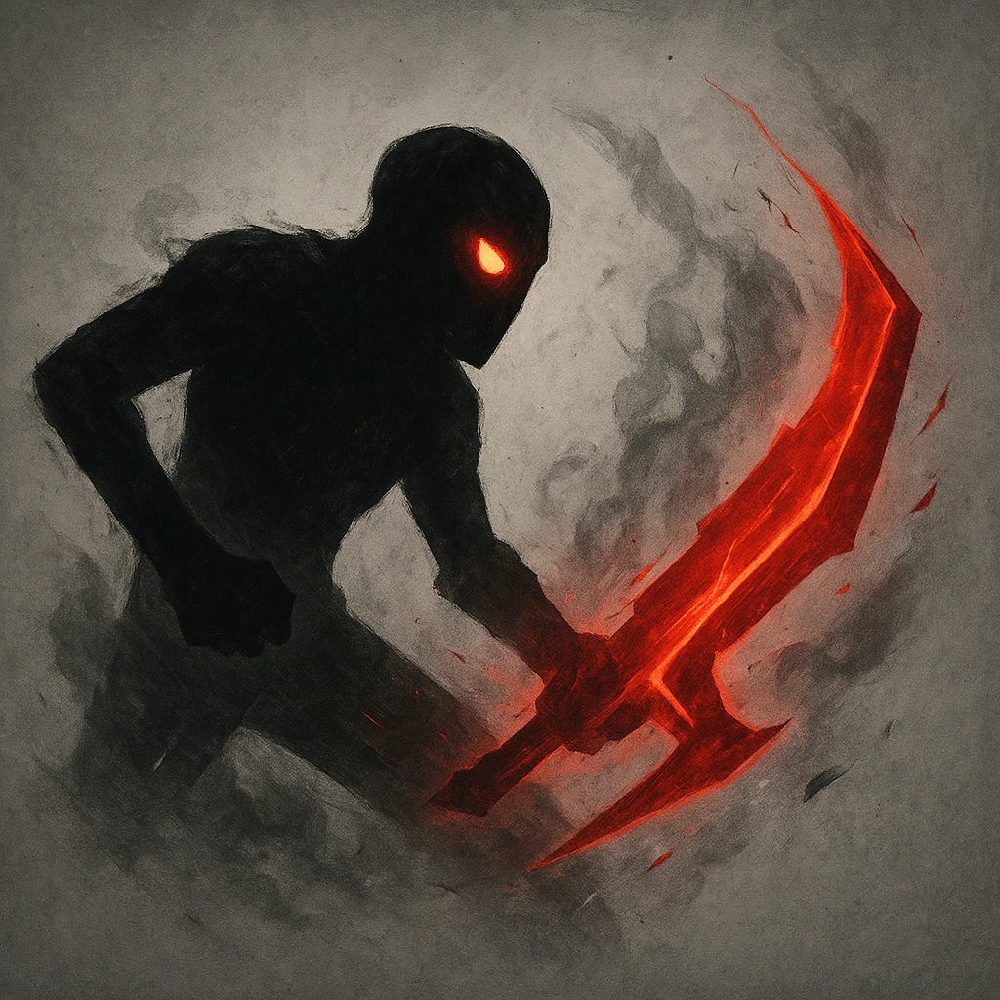

# Relentless (3)

## Description
*
The Dragon can be spotlighted up to three times per GM turn. Spend Fear as usual to spotlight them.
*

## Actions
—

---

adversaries-features/Solo
 
**UUID:** `Compendium.cybermancy.system.relentless-3`

