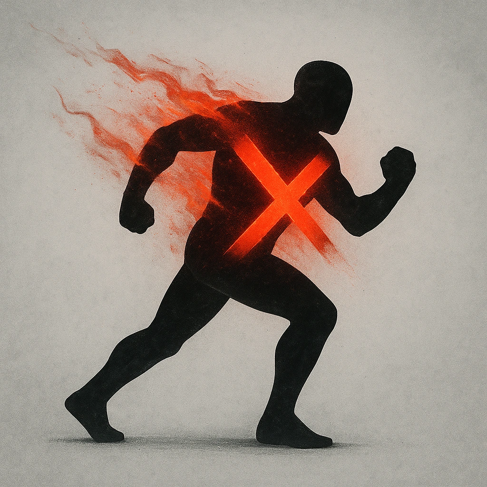

# Relentless (X)

## Description
*
The Hydra can be spotlighted X times per GM turn, where X is the Hydra’s number of heads. Spend Fear as usual to spotlight them.
*

## Actions
—

---

adversaries-features/Solo
 
**UUID:** `Compendium.cybermancy.system.relentless-x`

