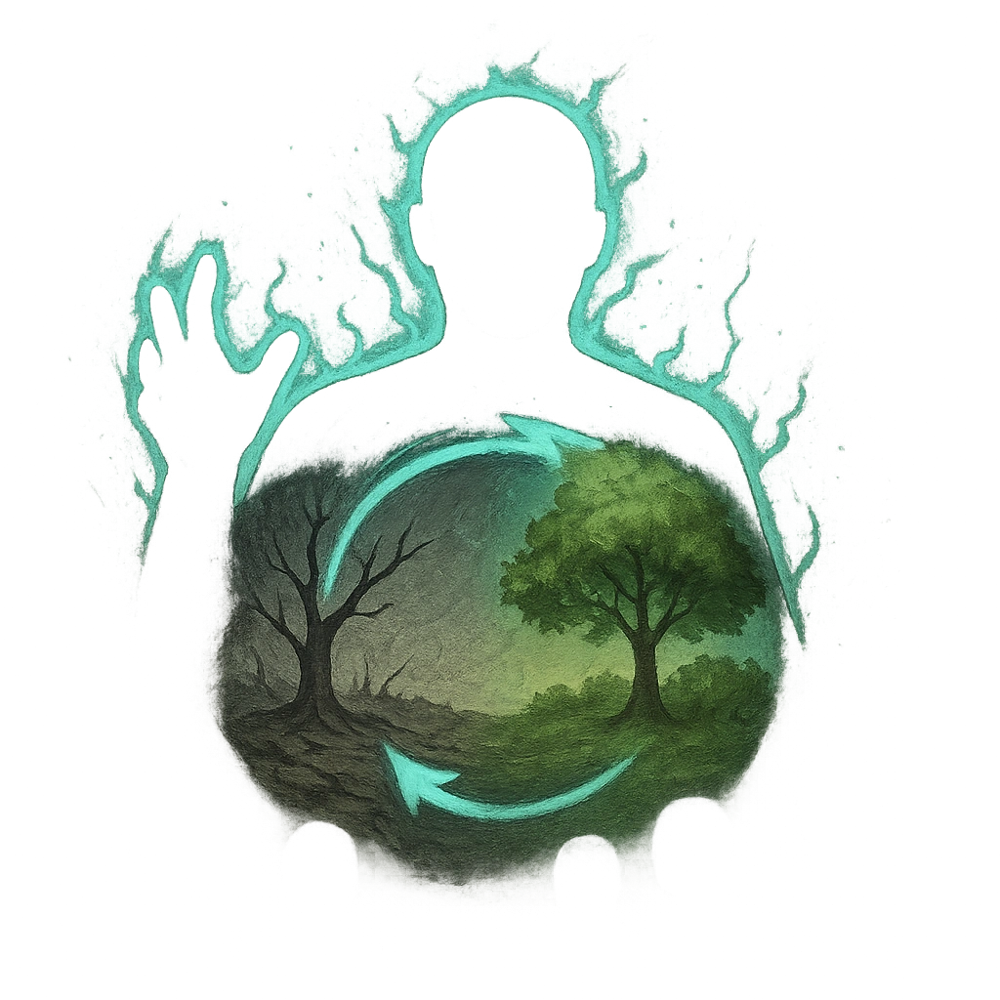

# Remake Reality

## Description
*
<strong>Spend a Fear</strong> to transform the area within Very Close range into a different biome. All targets within this area take <strong>2d6+3</strong> direct magic damage.

@Template[type:emanation|range:vc]
*

## Actions
- 
**Spend Fear** *vc]*

---

adversaries-features/Solo
 
**UUID:** `Compendium.cybermancy.system.remake-reality`

