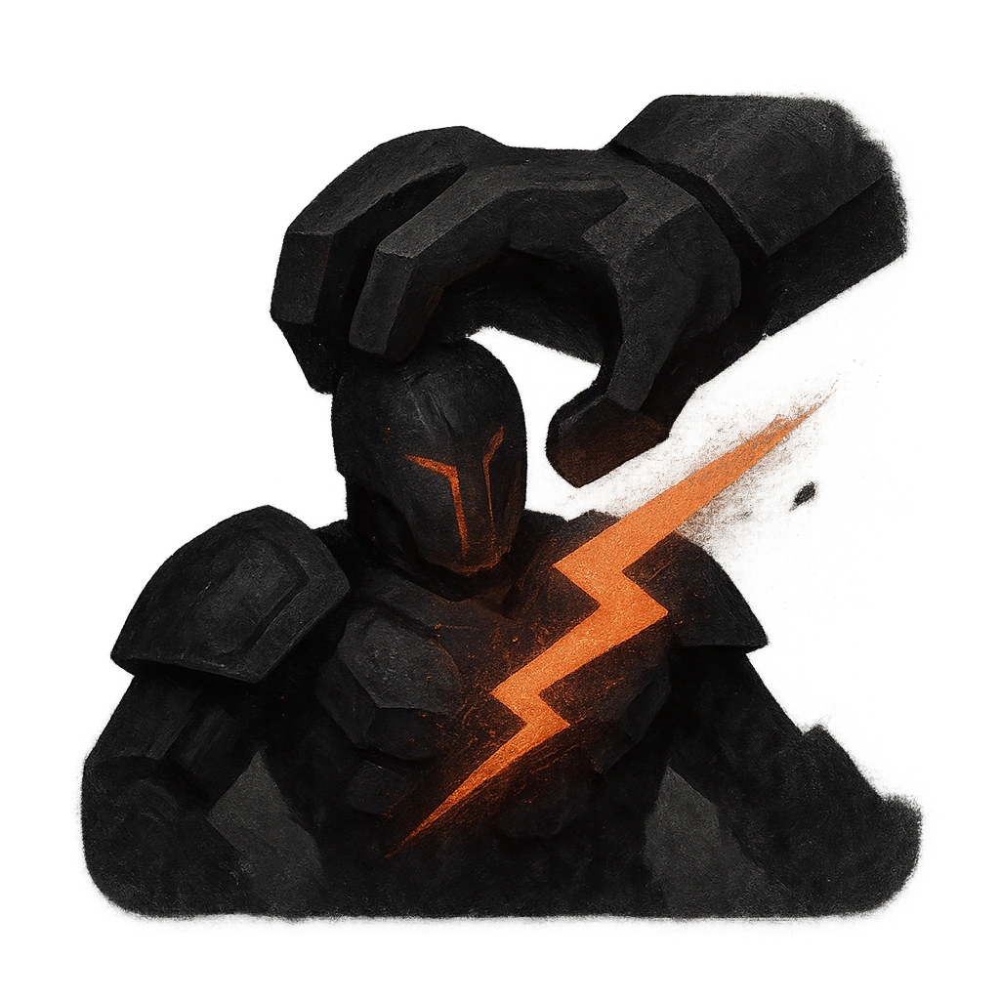

# Rend and Crush

## Description
*
If a target damaged by the Dragon doesn’t mark an Armor Slot to reduce the damage, they must mark a Stress.
*

## Actions
- 
**Mark Stress** *If a target damaged by the Dragon doesn’t mark an Armor Slot to reduce the damage, they must mark a Stress.*

---

adversaries-features/Solo
 
**UUID:** `Compendium.cybermancy.system.rend-and-crush`

