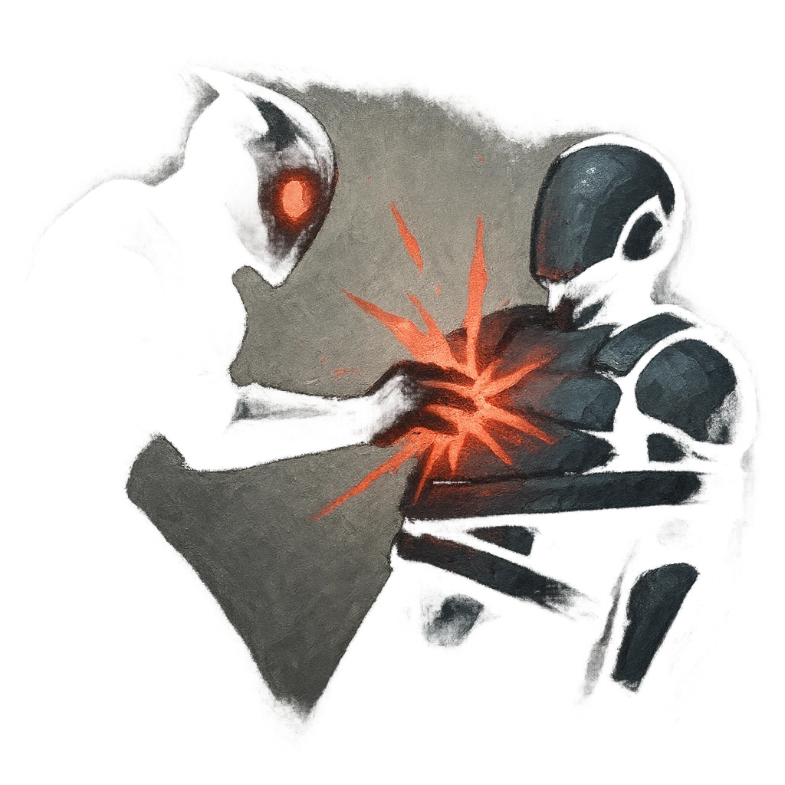

# Rend Asunder

## Description
*
Make a standard attack with advantage against a target the Zombie has <em>Restrained</em>. On a success, the attack deals direct damage.
*

## Actions
- 
**Attack** *Make a standard attack with advantage against a target the Zombie has Restrained. On a success, the attack deals direct damage.*

---

adversaries-features/Bruiser
 
**UUID:** `Compendium.cybermancy.system.rend-asunder`

