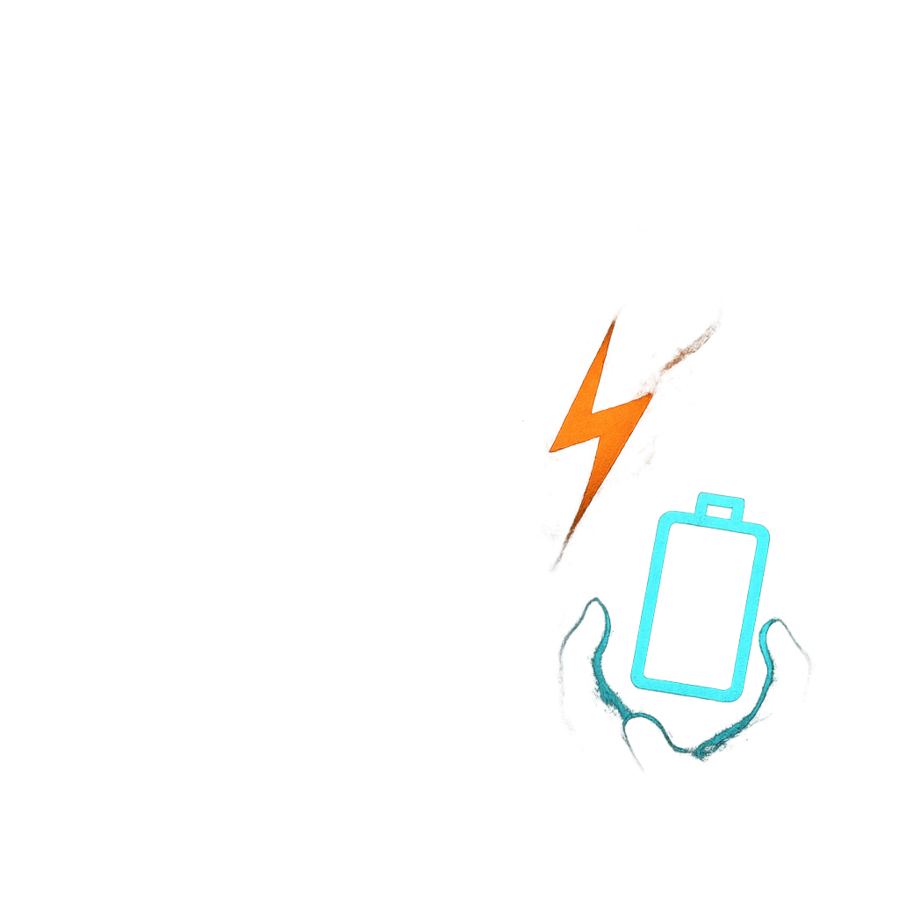

# Retalliation

## Description
*
When the Demon takes damage from an attack within Close range, you can <strong>mark a Stress</strong> to make a standard attack against the attacker.

@Template[type:emanation|range:c]
*

## Actions
- 
**Attack** *c]*

---

adversaries-features/Bruiser
 
**UUID:** `Compendium.cybermancy.system.retalliation`

