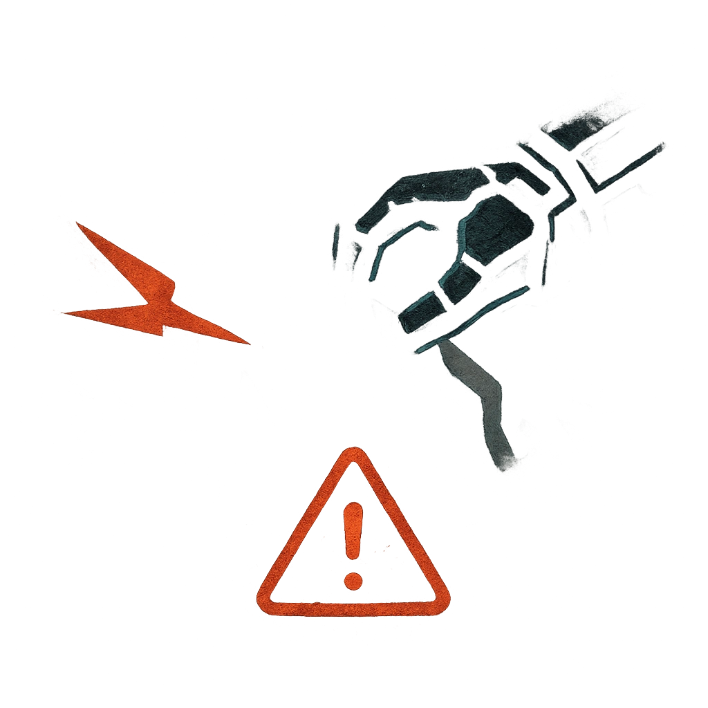

# Rip and Tear

## Description
*
When the Zombies makes a successful standard attack, you can <strong>mark a Stress</strong> to temporarily Restrain the target and force them to mark 2 Stress.
*

## Actions
- 
**Damage** *When the Zombies makes a successful standard attack, you can mark a Stress to temporarily Restrain the target and force them to mark 2 Stress.*

---

adversaries-features/Bruiser
 
**UUID:** `Compendium.cybermancy.system.rip-and-tear`

