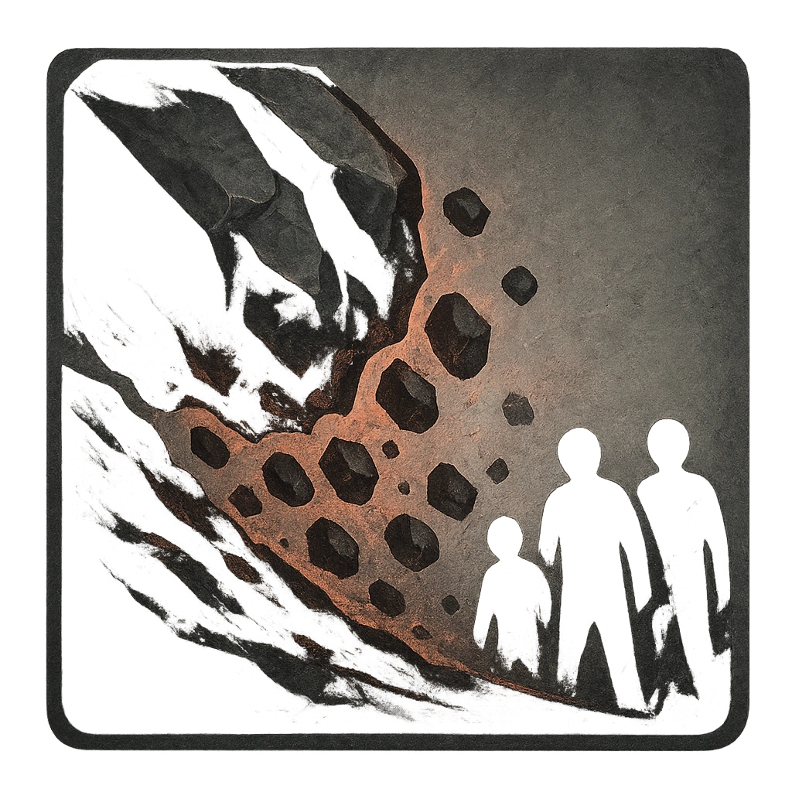

# Rockslide

## Description
*
<strong>Mark a Stress</strong> to create a rockslide that buries the land in front of Elemental within Close range with rockfall. All targets in this area must make an Agility Reaction Roll (19). Targets who fail take <strong>2d12+5</strong> physical damage and become Vulnerable until their next roll with Hope. Targets who succeed take half damage.

@Template[type:inFront|range:c]
*

## Actions
- 
**Roll Save** *c]*

---

adversaries-features/Bruiser
 
**UUID:** `Compendium.cybermancy.system.rockslide`

