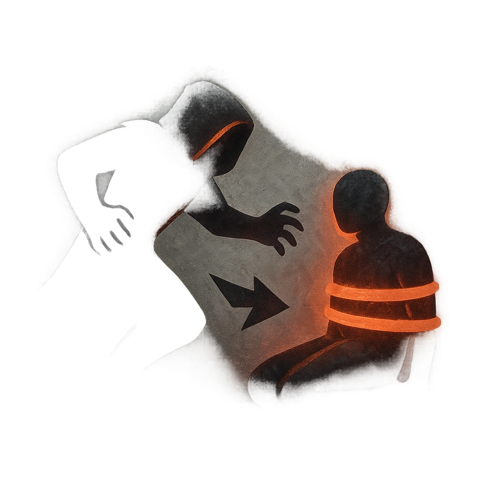

# Rocky Ambush

## Description
*
While <em>Hidden</em>, <strong>mark a Stress</strong> to leap into Melee range with a target within Very Close range. The target must succeed on an Agility or Instinct Reaction Roll (15) or take <strong>2d8</strong> physical damage and become temporarily Restrained.
*

## Actions
- 
**Attack** *While Hidden, mark a Stress to leap into Melee range with a target within Very Close range. The target must succeed on an Agility or Instinct Reaction Roll (15) or take 2d8 physical damage and become temporarily Restrained.*

---

adversaries-features/Skulk
 
**UUID:** `Compendium.cybermancy.system.rocky-ambush`

