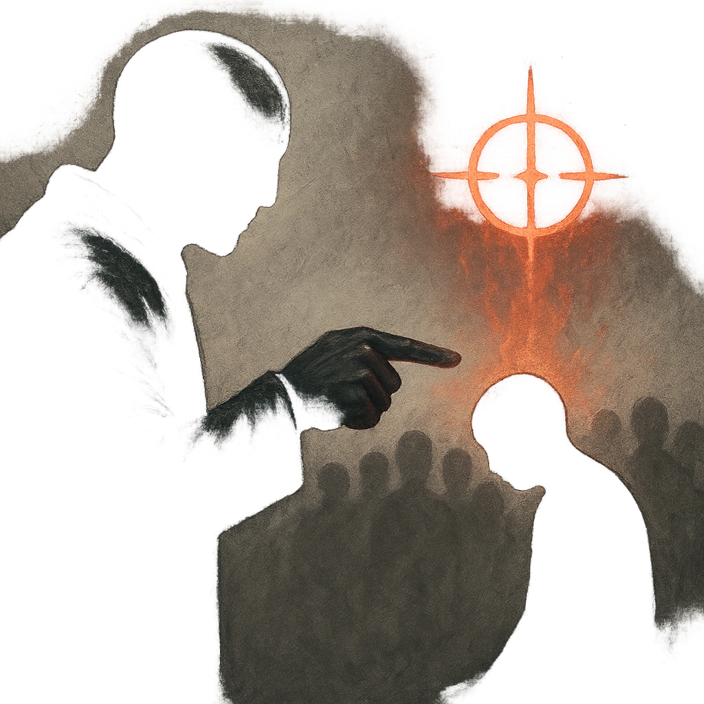

# Scapegoat

## Description
*
<strong>Spend a Fear</strong> to convince a crowd or notable individual that one person or group is responsible for some problem facing the target. The target becomes hostile to the scapegoat until convinced of their innocence with a successful Presence Roll (17).

[[/dr trait=presence difficulty=17]]
*

## Actions
- 
**Spend Fear** *Spend a Fear to convince a crowd or notable individual that one person or group is responsible for some problem facing the target. The target becomes hostile to the scapegoat until convinced of their innocence with a successful Presence Roll (17).[[/dr trait=presence difficulty=17]]*

---

adversaries-features/Social
 
**UUID:** `Compendium.cybermancy.system.scapegoat`

