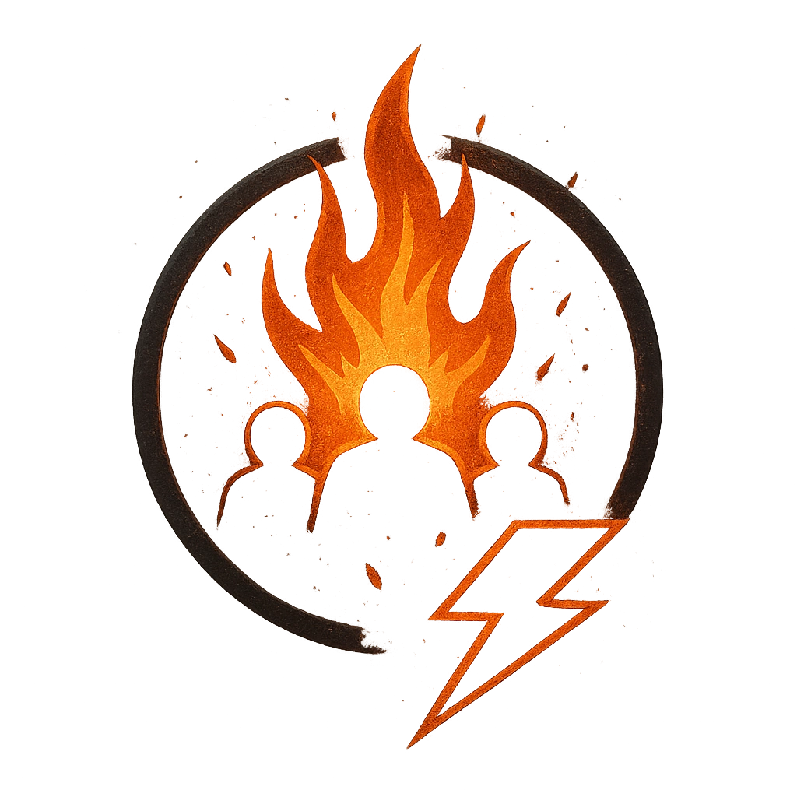

# Scorched Earth

## Description
*
<strong>Mark a Stress</strong> to choose a point within Far range. The ground within Very Close range of that point immediately bursts into fl ames. All creatures within this area must make an Agility Reaction Roll. Targets who fail take <strong>2d8</strong> magic damage from the fl ames. Targets who succeed take half damage.

@Template[type:circle|range:vc]
*

## Actions
- 
**Attack** *vc]*

---

adversaries-features/Solo
 
**UUID:** `Compendium.cybermancy.system.scorched-earth`

