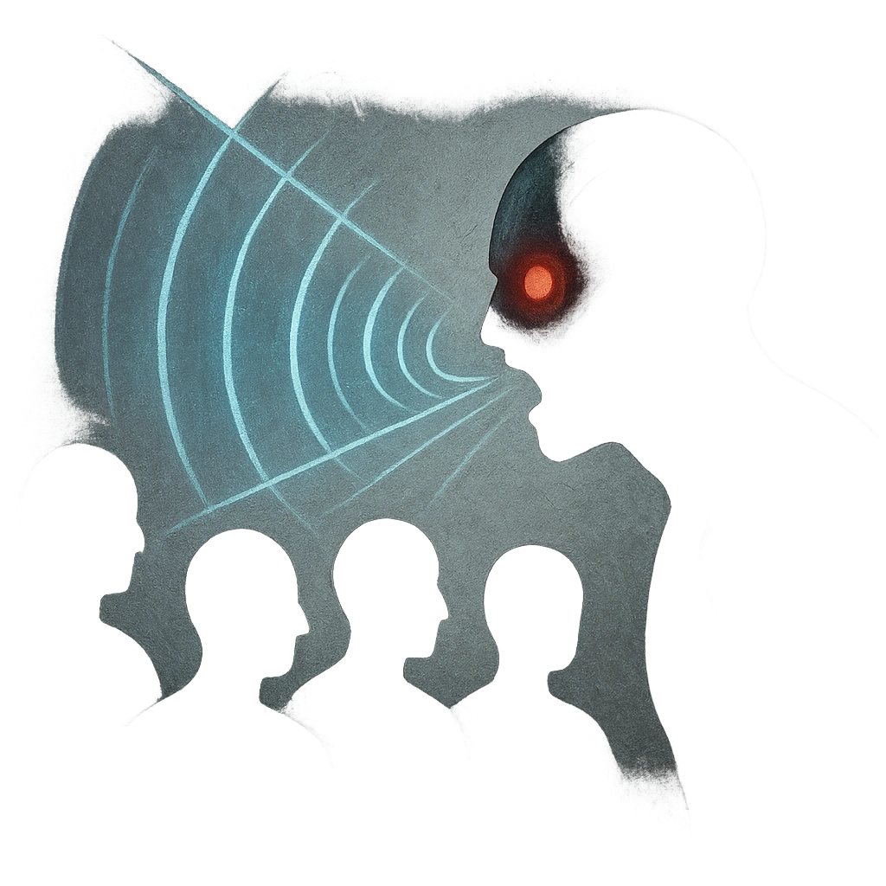

# Screech

## Description
*
<strong>Mark a Stress</strong> to send a high-pitch screech out toward all targets in front of the Bat within Far range. Those targets must mark <strong>1d4</strong> Stress.

@Template[type:inFront|range:f]
*

## Actions
- 
**Mark Stress** *f]*

---

adversaries-features/Skulk
 
**UUID:** `Compendium.cybermancy.system.screech`

