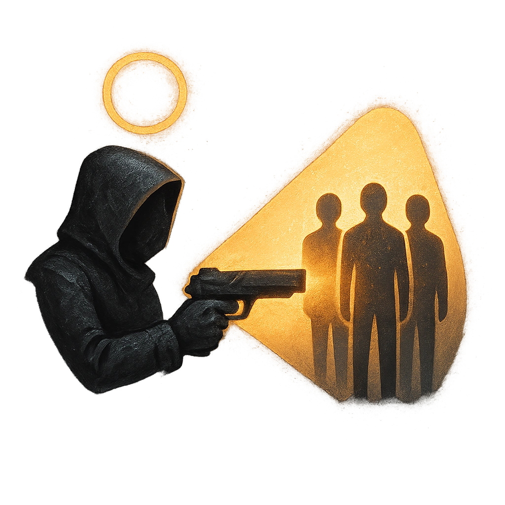

# Seize Your Moment

## Description
*
<strong>Spend 2 Fear</strong> to spotlight <strong>1d4</strong> allies. Attacks they make while spotlighted in this way deal half damage.
*

## Actions
- 
**Spotlight Allies** *Spend 2 Fear to spotlight 1d4 allies. Attacks they make while spotlighted in this way deal half damage.*

---

adversaries-features/Leader
 
**UUID:** `Compendium.cybermancy.system.seize-your-moment`

