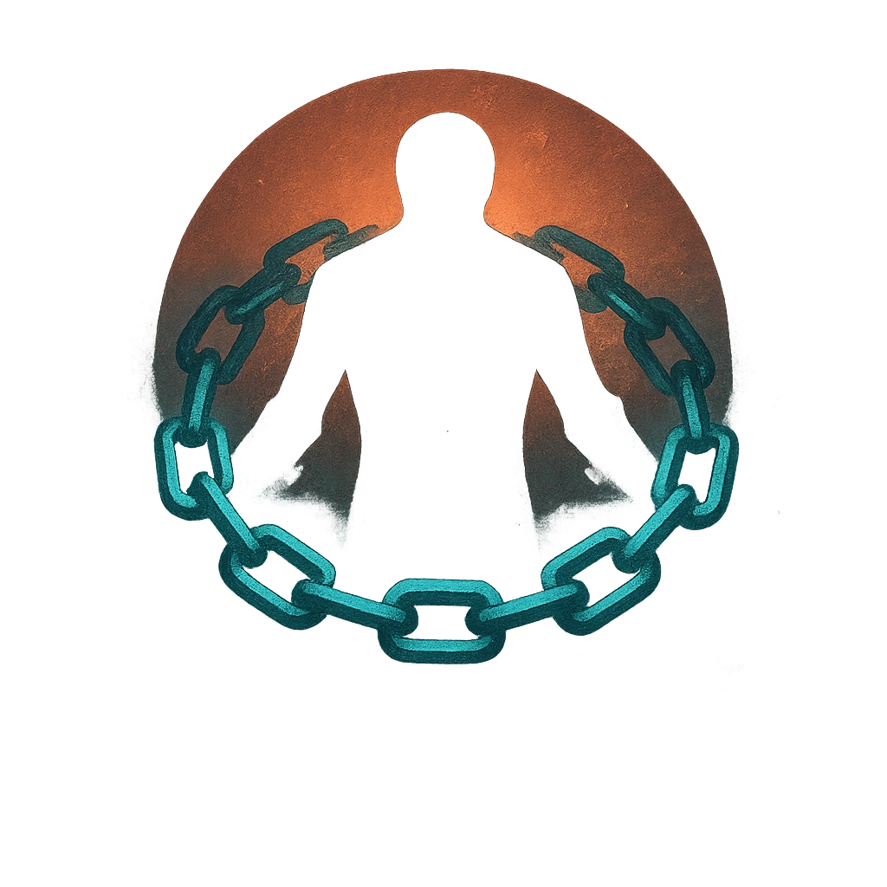

# Shackles of Guilt

## Description
*
Countdown (Loop 2d6). When the Sorcerer is in the spotlight for the first time, activate the countdown. When it triggers, all targets within Far range become Vulnerable and must mark a Stress as they relive their greatest regrets. A target can break free from their regret with a successful Presence or Strength Roll. When a PC fails to break free, they lose a Hope.

@Template[type:emanation|range:f]
*

## Actions
- 
**Countdown** *Countdown (Loop 2d6). When the Sorcerer is in the spotlight for the first time, activate the countdown.*

- 
**Mark Stress** *f]*

---

adversaries-features/Support
 
**UUID:** `Compendium.cybermancy.system.shackles-of-guilt`

