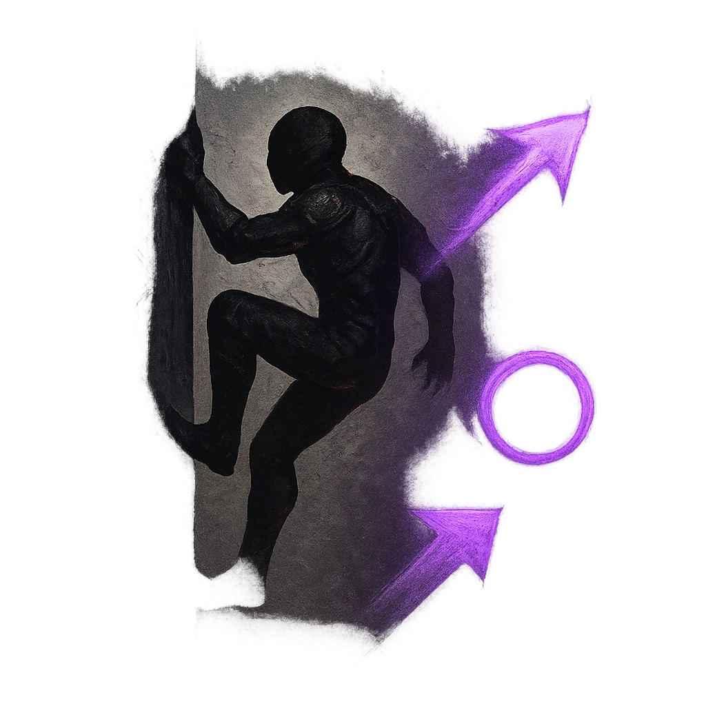

# Shadow's Embrace

## Description
*
The Fang can climb and walk on vertical surfaces. <strong>Mark a Stress</strong> to move from one shadow to another within Far range.
*

## Actions
- 
**Mark Stress** *The Fang can climb and walk on vertical surfaces. Mark a Stress to move from one shadow to another within Far range.*

---

adversaries-features/Skulk
 
**UUID:** `Compendium.cybermancy.system.shadow-s-embrace`

