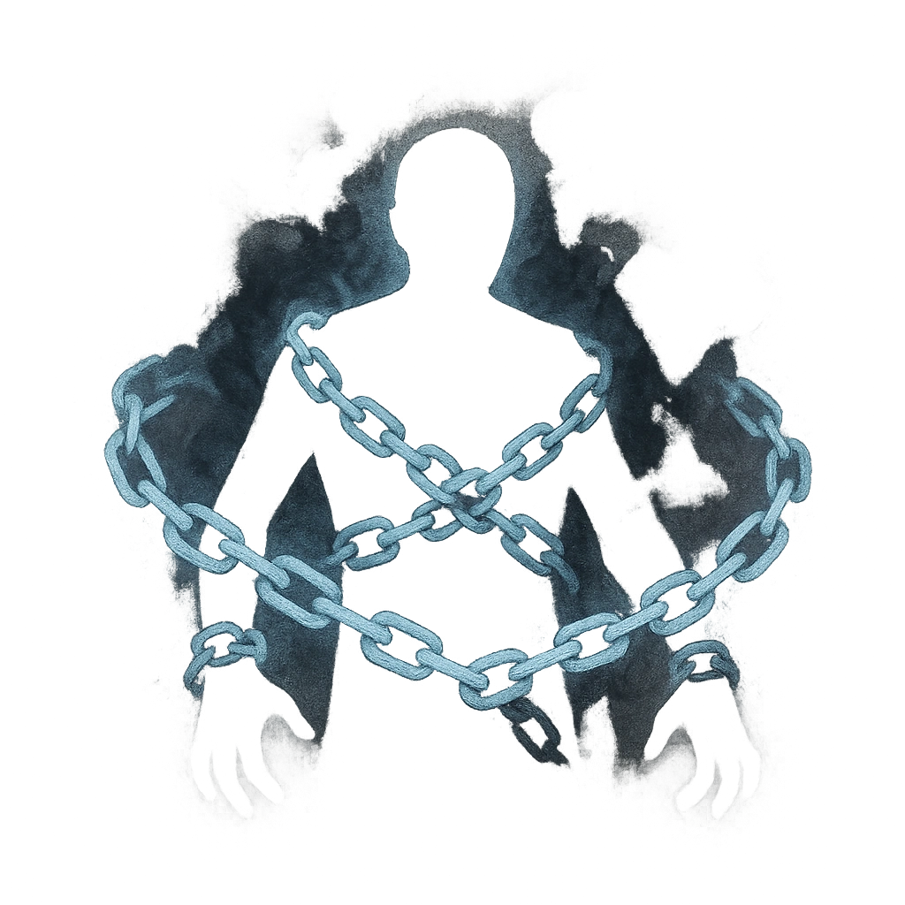

# Shadow Shackles

## Description
*
<strong>Spend a Fear</strong> and choose a point within Far range. All targets within Close range of that point are <em>Restrained</em> in smoky chains until they break free with a successful Strength or Instinct Roll. A target Restrained by this feature must spend a Hope to make an action roll.

@Template[type:circle|range:c]
*

## Actions
- 
**Spend Fear** *c]*

---

adversaries-features/Support
 
**UUID:** `Compendium.cybermancy.system.shadow-shackles`

