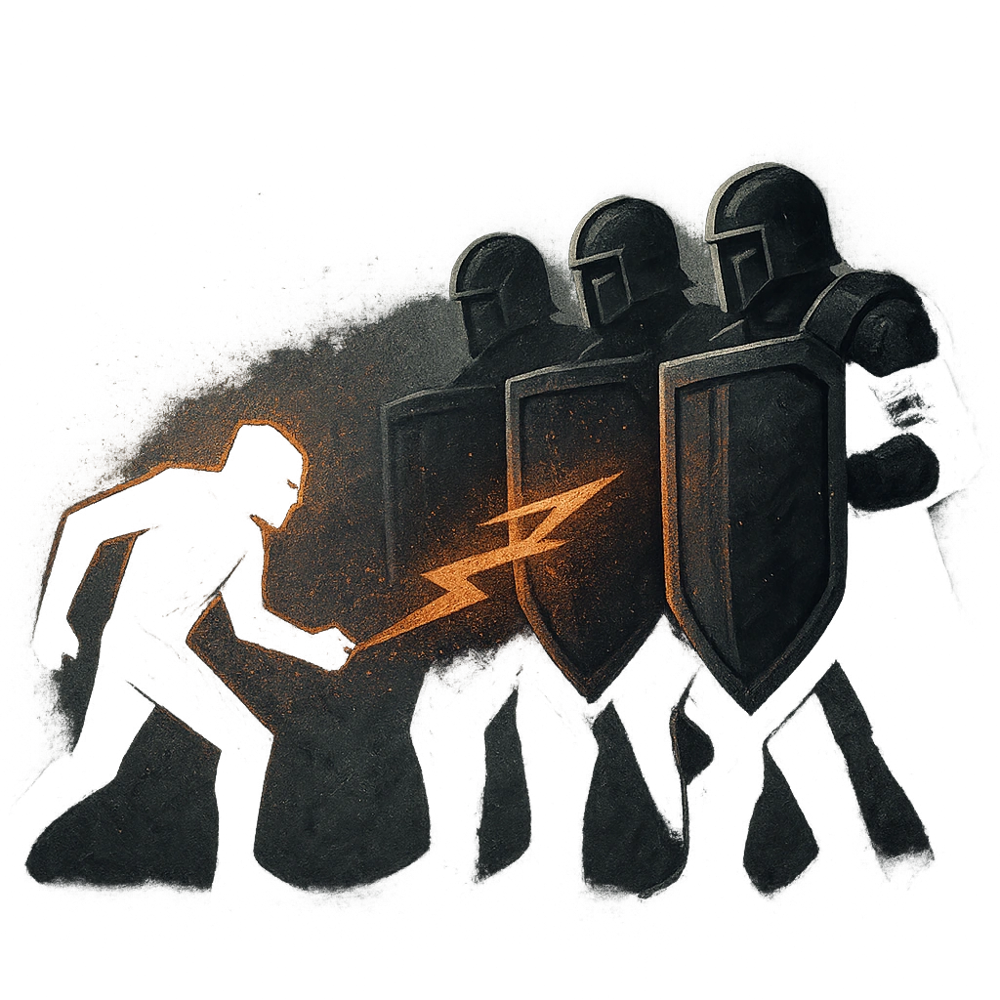

# Shield Wall

## Description
*
A creature who tries to move within Very Close range of the Guard must succeed on an Agility Roll. If additional Bladed Guards are standing in a line alongside the f i rst, and each is within Melee range of another guard in the line, the Diffi  culty increases by the total number of guards in that line.
*

## Actions
- 
**Block** *A creature who tries to move within Very Close range of the Guard must succeed on an Agility Roll. If additional Bladed Guards are standing in a line alongside the first, and each is within Melee range of another guard in the line, the Difficulty increases by the total number of guards in that line.*

---

adversaries-features/Standard
 
**UUID:** `Compendium.cybermancy.system.shield-wall`

