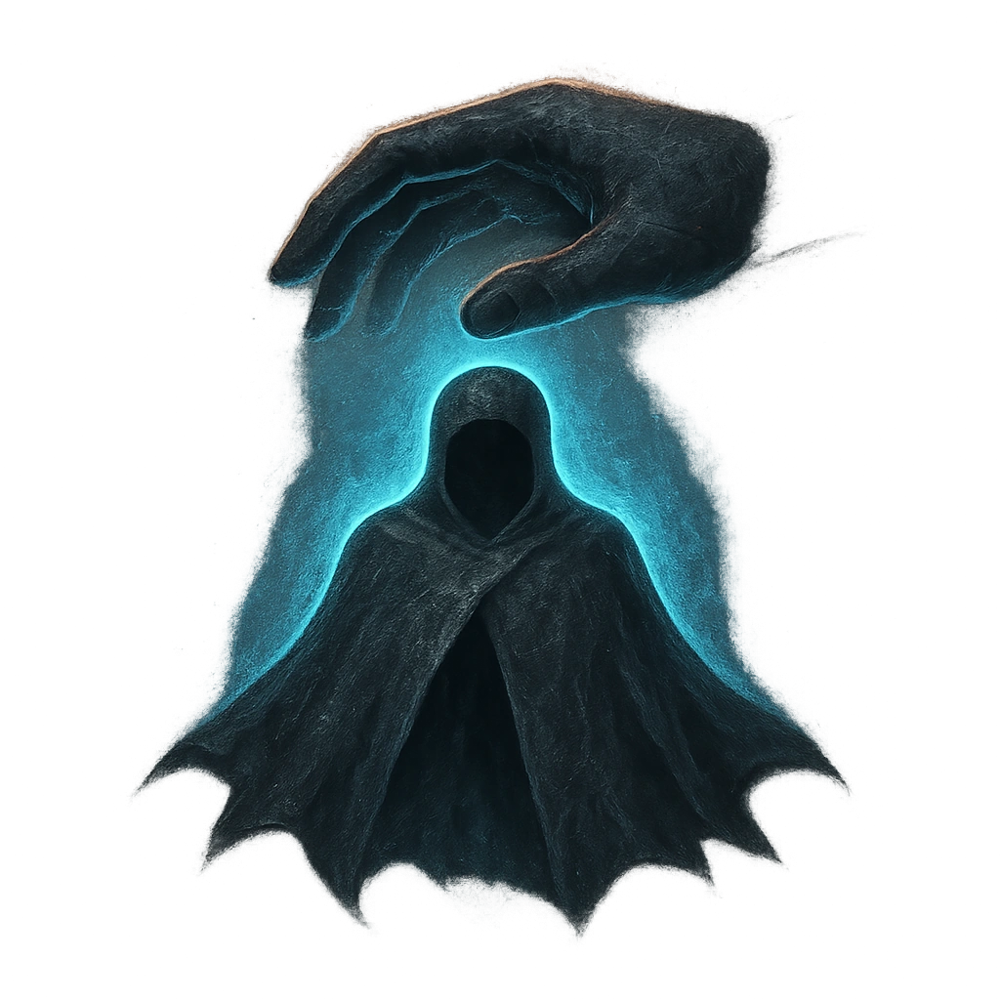

# Shroud of the Fallen

## Description
*
<strong>Mark a Stress</strong> to wrap an ally within Close range in a shroud of Protection until the Adept marks their last HP. While Protected, the target has resistance to all damage.
*

## Actions
- 
**Protect** *Mark a Stress to wrap an ally within Close range in a shroud of Protection until the Adept marks their last HP. While Protected, the target has resistance to all damage.*

---

adversaries-features/Support
 
**UUID:** `Compendium.cybermancy.system.shroud-of-the-fallen`

