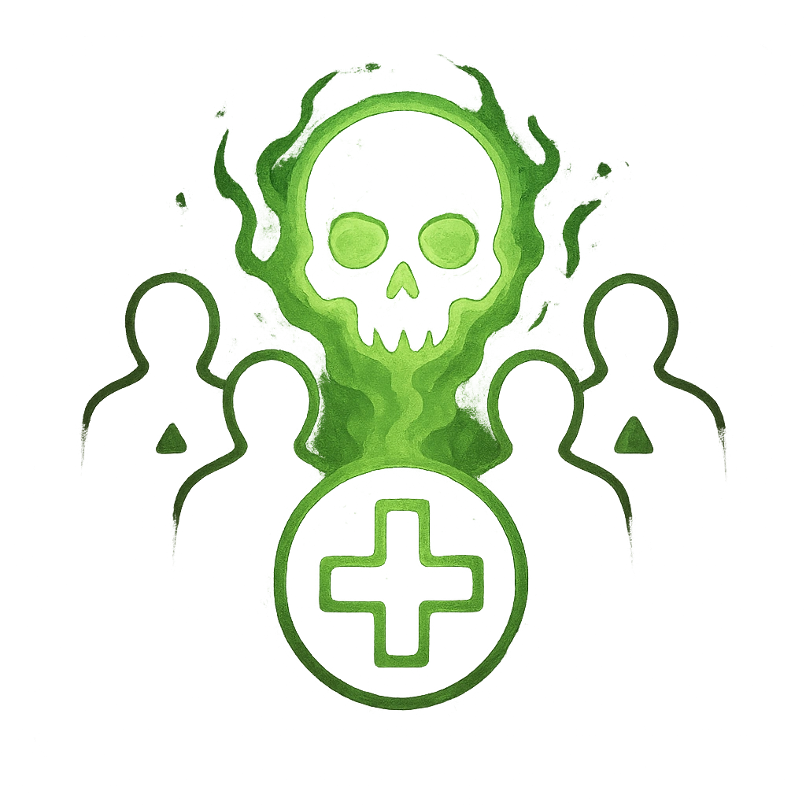

# Sickening Flux

## Description
*
<strong>Mark a HP</strong> to force all targets within Close range to mark a Stress and become <em>Vulnerable</em> until their next rest or they clear a HP.

@Template[type:emanation|range:c]
*

## Actions
- 
**Mark HP** *c]*

---

adversaries-features/Solo
 
**UUID:** `Compendium.cybermancy.system.sickening-flux`

