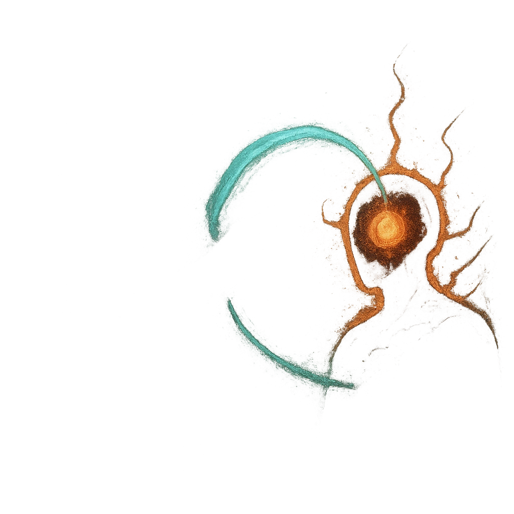

# Siphon Magic

## Description
*
<strong>Spend a Fear</strong> to make an attack against a PC with a Spellcast trait within Very Close range. On a success, the target marks <strong>1d4</strong> Stress and the Skull clears that many Stress. Additionally, on a success, the Skull can immediately be spotlighted again.
*

## Actions
- 
**Attack** *Spend a Fear to make an attack against a PC with a Spellcast trait within Very Close range. On a success, the target marks 1d4 Stress and the Skull clears that many Stress. Additionally, on a success, the Skull can immediately be spotlighted again.*

---

adversaries-features/Ranged
 
**UUID:** `Compendium.cybermancy.system.siphon-magic`

