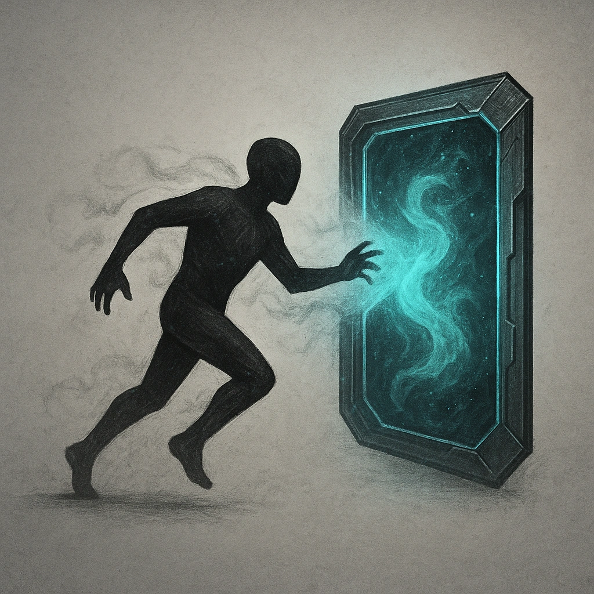

# Slippery

## Description
*
When the Sorcerer takes damage from an attack, they can teleport up to Far range.
*

## Actions
—

---

adversaries-features/Support
 
**UUID:** `Compendium.cybermancy.system.slippery`

