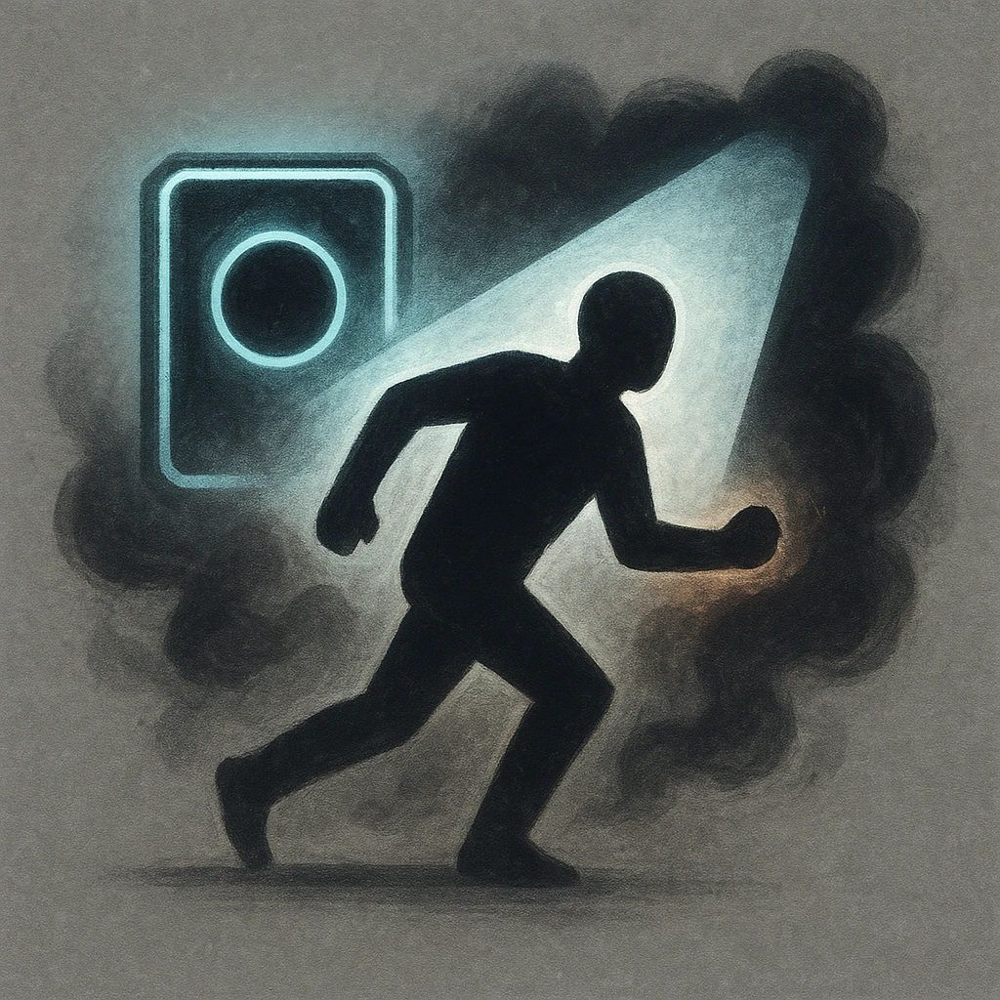

# Slow

## Description
*
When you spotlight the Ooze and they don’t have a token on their stat block, they can’t act yet. Place a token on their stat block and describe what they’re preparing to do. When you spotlight the Ooze and they have a token on their stat block, clear the token and they can act.
*

## Actions
—

---

adversaries-features/Skulk
 
**UUID:** `Compendium.cybermancy.system.slow`

