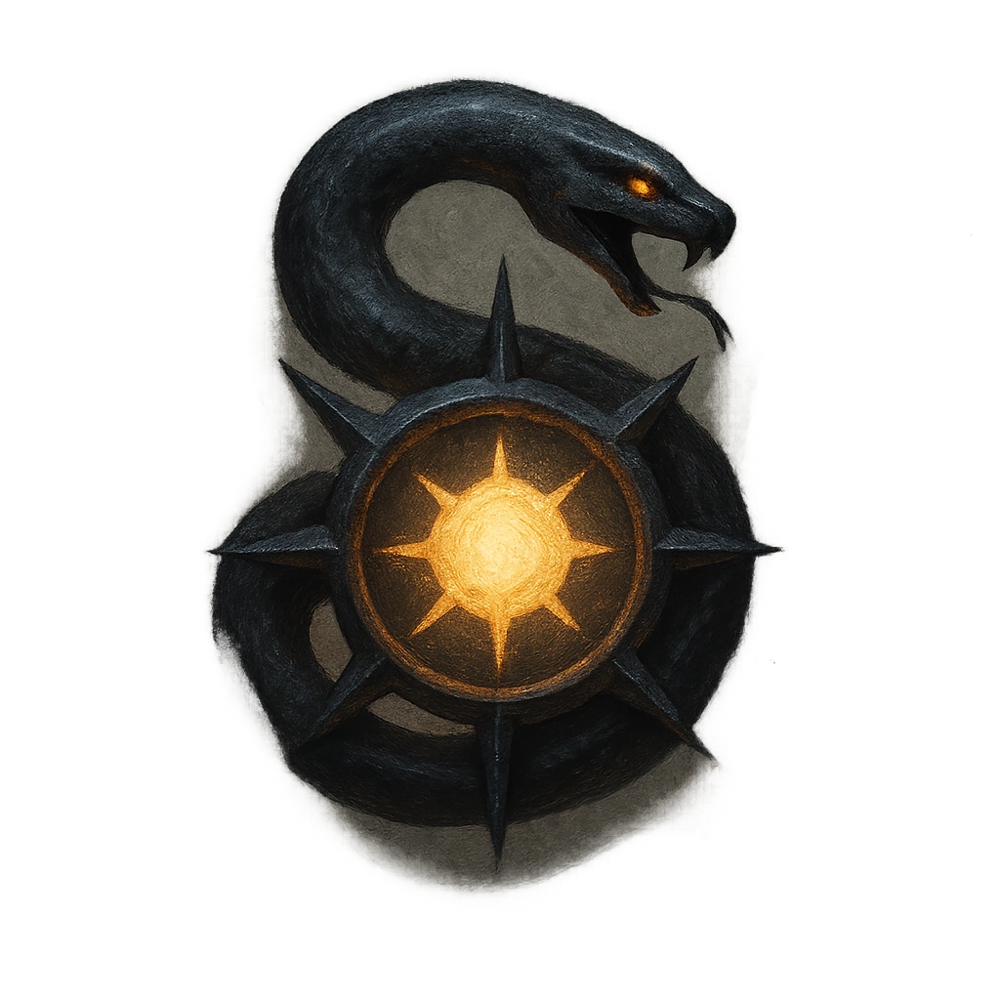

# Spinning Serpent

## Description
*
<strong>Mark a Stress</strong> to make an attack against all targets within Very Close range. Targets the Snake succeeds against take <strong>1d6+1</strong> physical damage.
*

## Actions
- 
**Attack** *Mark a Stress to make an attack against all targets within Very Close range. Targets the Snake succeeds against take 1d6+1 physical damage.*

---

adversaries-features/Standard
 
**UUID:** `Compendium.cybermancy.system.spinning-serpent`

