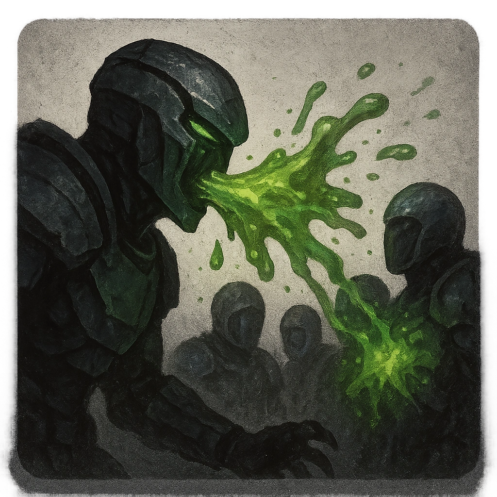

# Spit Acid

## Description
*
Make an attack against all targets in front of the Burrower within Close range. Targets the Burrower succeeds against take <strong>2d6</strong> physical damage and must mark an Armor Slot without receiving its benefi ts (they can still use armor to reduce the damage). If they can’t mark an Armor Slot, they must mark an additional HP and you gain a Fear.

@Template[type:inFront|range:c]
*

## Actions
- 
**Attack** *c]*

---

adversaries-features/Solo
 
**UUID:** `Compendium.cybermancy.system.spit-acid`

