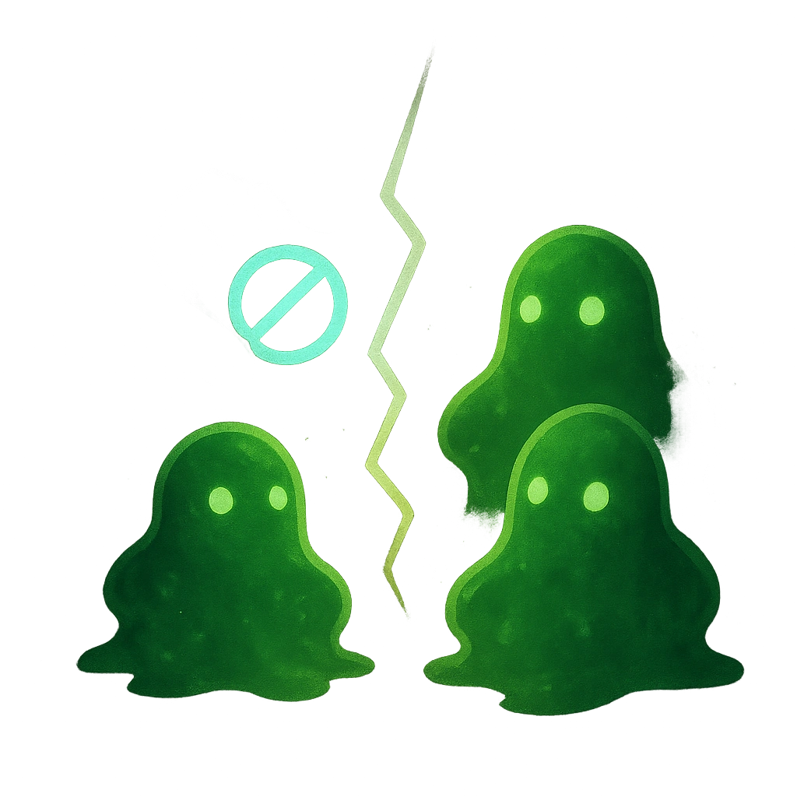

# Split

## Description
*
When the Ooze has 3 or more HP marked, you can <strong>spend a Fear</strong> to split them into two @UUID[Compendium.daggerheart.adversaries.Actor.1fkLQXVtmILqfJ44]{Tiny Red Oozes} (with no marked HP or Stress). Immediately spotlight both of them.
*

## Actions
- 
**Spend Fear** *When the Ooze has 3 or more HP marked, you can spend a Fear to split them into two @UUID[Compendium.daggerheart.adversaries.Actor.1fkLQXVtmILqfJ44]{Tiny Red Oozes} (with no marked HP or Stress). Immediately spotlight both of them.*

---

adversaries-features/Skulk
 
**UUID:** `Compendium.cybermancy.system.split`

