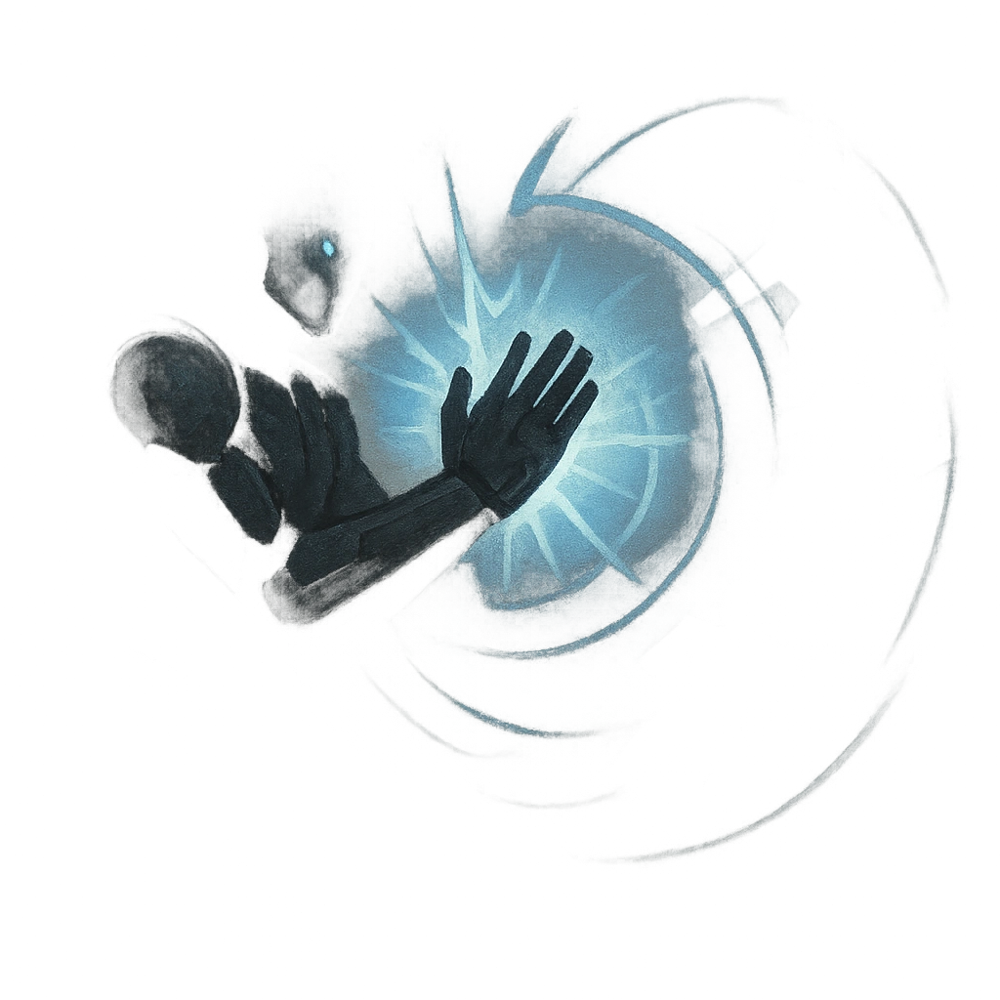

# Stunning Clap

## Description
*
The Box leaps and their sides clap, creating a small sonic boom. All targets within Very Close range must succeed on a Strength Reaction Roll or become <em>Vulnerable</em> until the cube is defeated.

@Template[type:emanation|range:vc]
*

## Actions
- 
**Roll Save** *vc]*

---

adversaries-features/Solo
 
**UUID:** `Compendium.cybermancy.system.stunning-clap`

