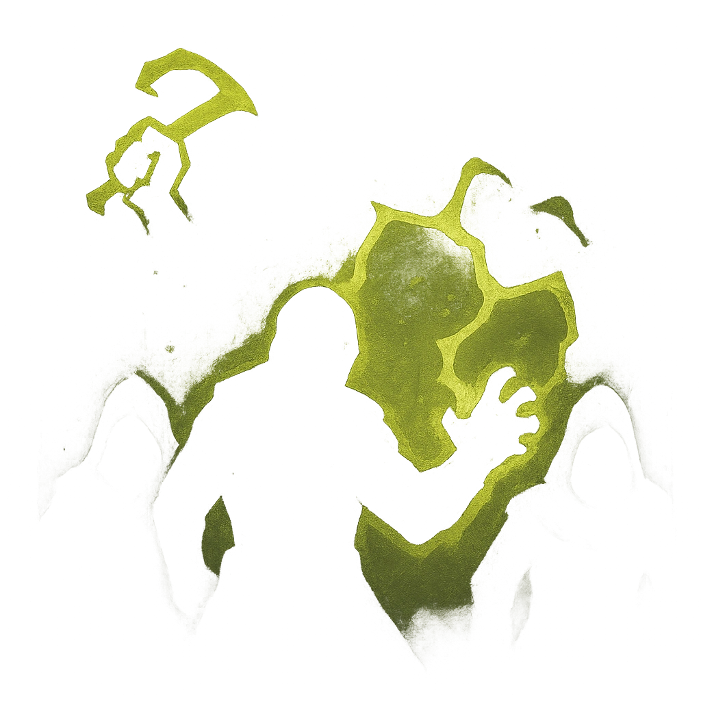

# Summon Tormentors

## Description
*
Once per day, <strong>spend 2 Fear</strong> to summon <strong>2d4</strong> Tier 2 or below Minions relevant to one of the PC’s personal nightmares. They appear at Close range relative to that PC.
*

## Actions
- 
**Roll 2d4** *Once per day, spend 2 Fear to summon 2d4 Tier 2 or below Minions relevant to one of the PC’s personal nightmares. They appear at Close range relative to that PC.*

---

adversaries-features/Solo
 
**UUID:** `Compendium.cybermancy.system.summon-tormentors`

