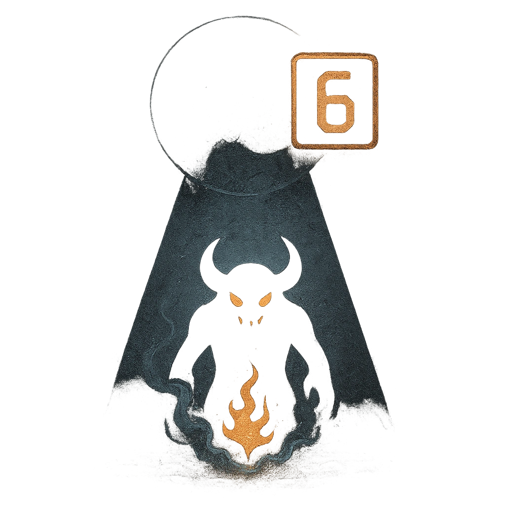

# Summoning Ritual

## Description
*
Countdown (6). When the Secret-Keeper is in the spotlight for the first time, activate the countdown. When they mark HP, tick down this countdown by the number of HP marked. When it triggers, summon a @UUID[Compendium.daggerheart.adversaries.Actor.3tqCjDwJAQ7JKqMb]{Minor Demon} who appears at Close range.
*

## Actions
- 
**Countdown** *Countdown (6). When the Secret-Keeper is in the spotlight for the first time, activate the countdown. When they mark HP, tick down this countdown by the number of HP marked.*

- 
**Summon** *When the countdown triggers, summon a @UUID[Compendium.daggerheart.adversaries.Actor.3tqCjDwJAQ7JKqMb]{Minor Demon} who appears at Close range.*

---

adversaries-features/Leader
 
**UUID:** `Compendium.cybermancy.system.summoning-ritual`

