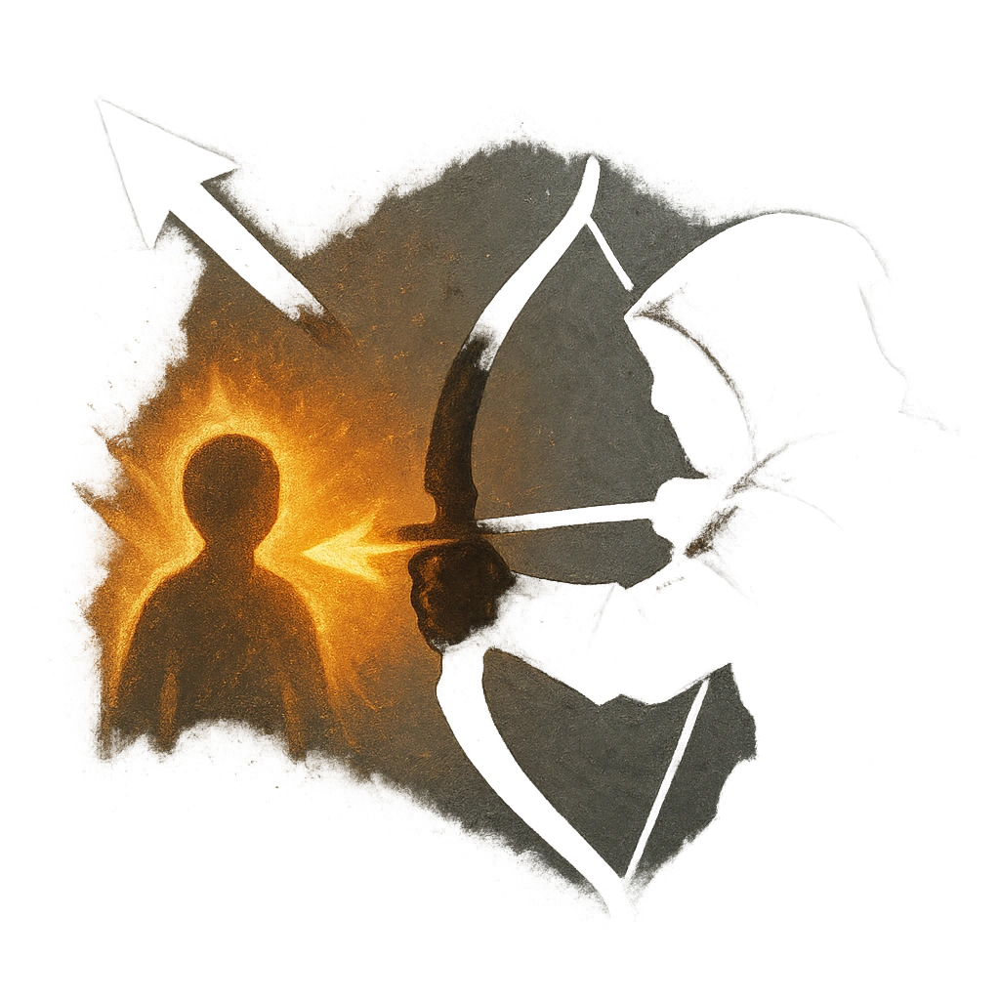

# Sunsear Arrows

## Description
*
When the Gorgon makes a successful standard attack, the target Glows until the end of the scene and can’t become <em>Hidden</em>. Attack rolls made against a Glowing target have advantage.
*

## Actions
- 
**Glow** *When the Gorgon makes a successful standard attack, the target Glows until the end of the scene and can’t become Hidden. Attack rolls made against a Glowing target have advantage.*

---

adversaries-features/Solo
 
**UUID:** `Compendium.cybermancy.system.sunsear-arrows`

