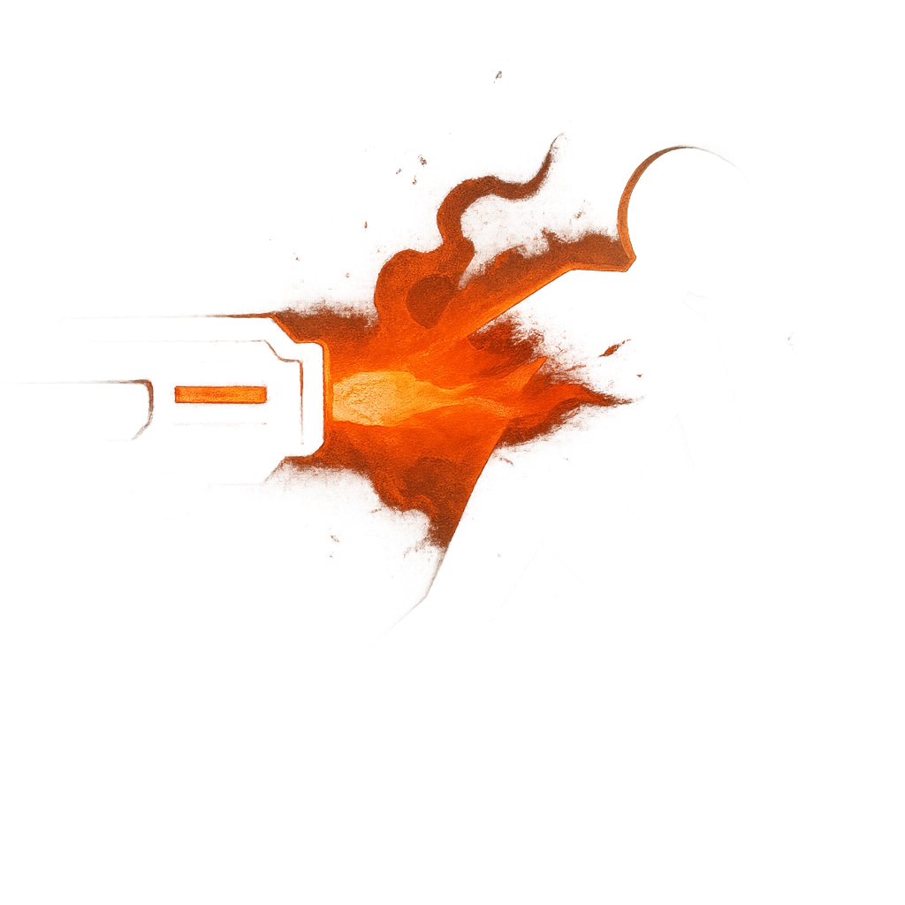

# Supressing Fire

## Description
*
<strong>Mark a Stress</strong> to target a point within Far range. Until the next roll with Fear, a creature who moves within Close range of that point must make an Agility Reaction Roll. On a failure, they take <strong>2d6+3</strong> physical damage. On a success, they take half damage.

@Template[type:circle|range:c]
*

## Actions
- 
**Agility Roll** *c]*

---

adversaries-features/Horde
 
**UUID:** `Compendium.cybermancy.system.supressing-fire`

