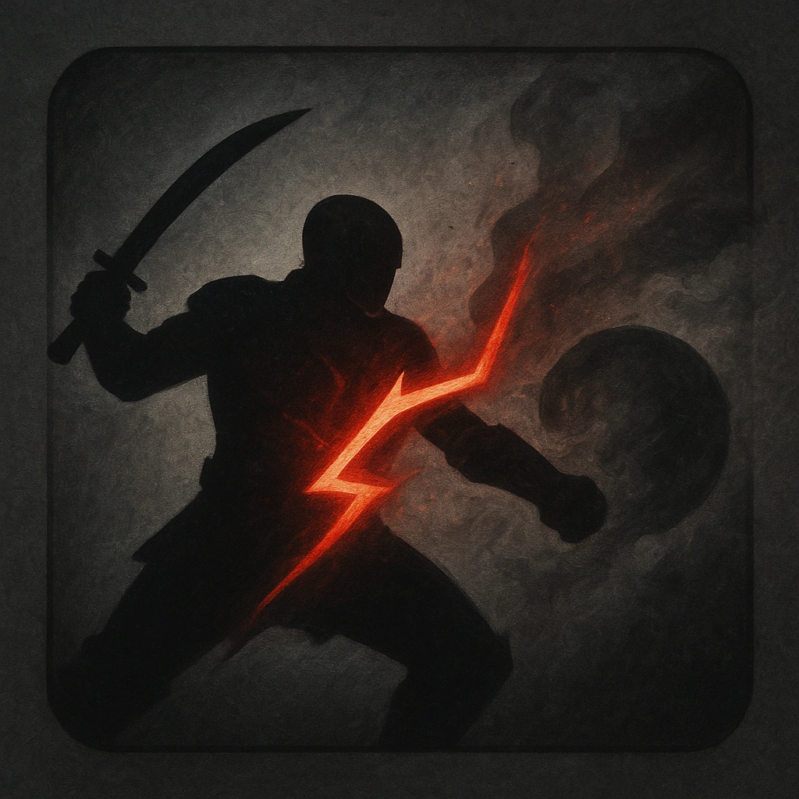

# Swashbuckler

## Description
*
When the Tough marks 2 or fewer HP from an attack within Melee range, the attacker must mark a Stress.
*

## Actions
- 
**Stress Damage** *When the Tough marks 2 or fewer HP from an attack within Melee range, the attacker must mark a Stress.*

---

adversaries-features/Bruiser
 
**UUID:** `Compendium.cybermancy.system.swashbuckler`

