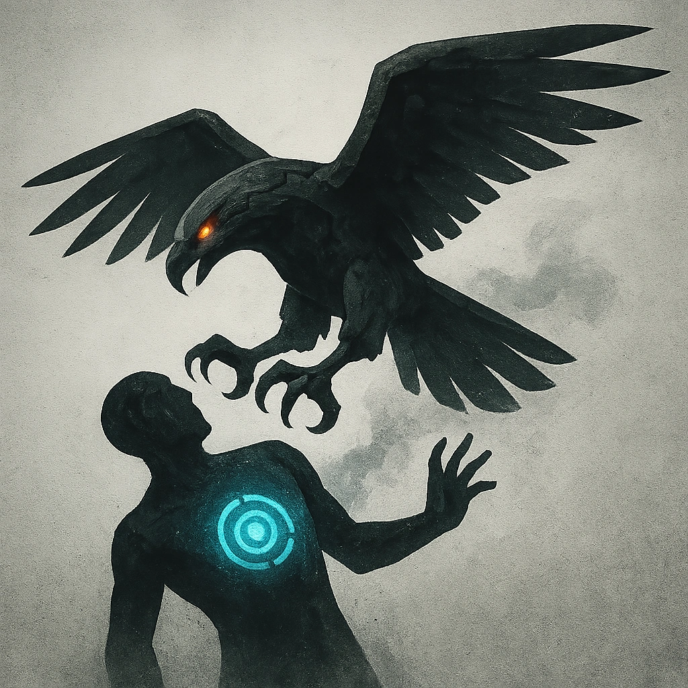

# Take Off

## Description
*
Make an attack against a target within Very Close range. On a success, deal <strong>2d4+3</strong> physical damage and the target must succeed on an Agility Reaction Roll or become temporarily Restrained within the Eagle’s massive talons. If the target is Restrained, the Eagle immediately lifts into the air to Very Far range above the battlefi eld while holding them. 
*

## Actions
- 
**Attack** *Make an attack against a target within Very Close range. On a success, deal 2d4+3 physical damage and the target must succeed on an Agility Reaction Roll or become temporarily Restrained within the Eagle’s massive talons. If the target is Restrained, the Eagle immediately lifts into the air to Very Far range above the battlefi eld while holding them.*

---

adversaries-features/Skulk
 
**UUID:** `Compendium.cybermancy.system.take-off`

