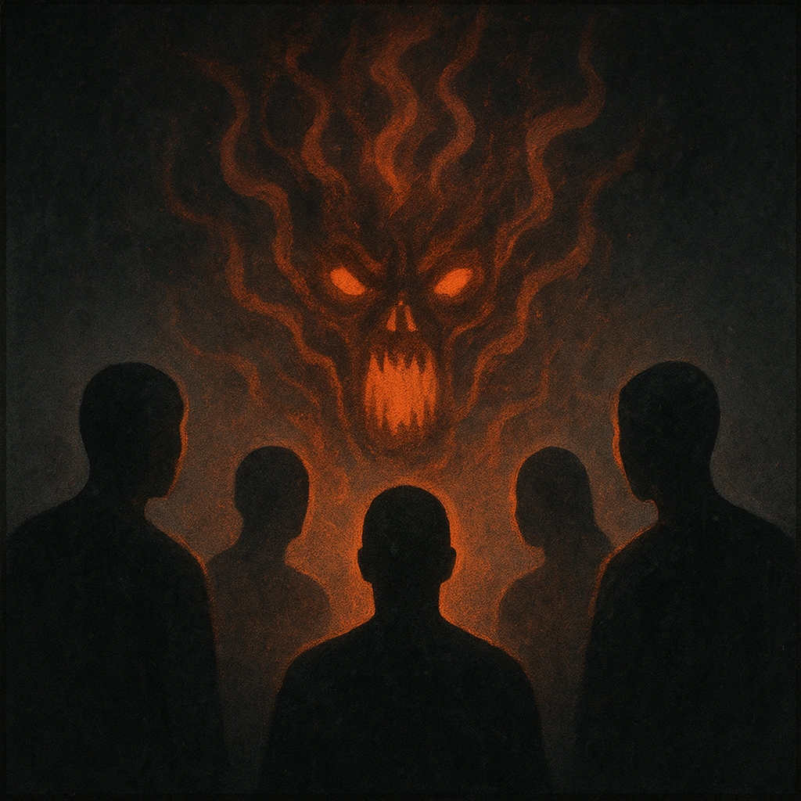

# Terrifying Chorus

## Description
*
All PCs within Far range lose 2 Hope.

@Template[type:emanation|range:f]
*

## Actions
- 
**Lose Hope** *f]*

---

adversaries-features/Solo
 
**UUID:** `Compendium.cybermancy.system.terrifying-chorus`

