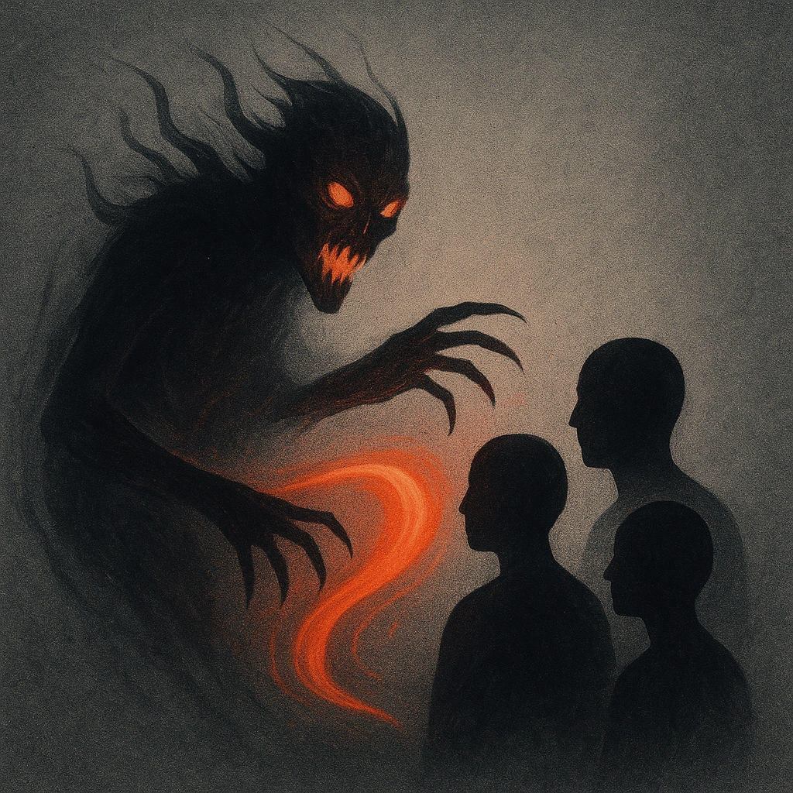

# Terrifying

## Description
*
When the Zombie makes a successful attack, all PCs within Far range lose a Hope and you gain a Fear.

@Template[type:emanation|range:f]
*

## Actions
- 
**Lose Hope** *f]*

---

adversaries-features/Bruiser
 
**UUID:** `Compendium.cybermancy.system.terrifying`

