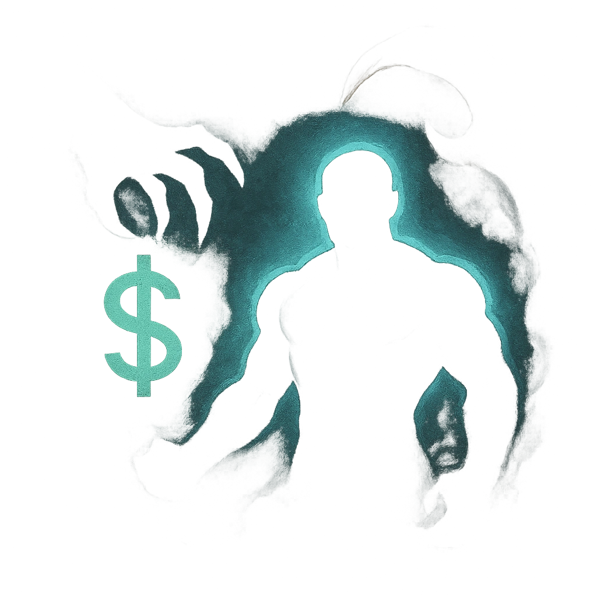

# The Best Muscle Money Can Buy

## Description
*
Once per scene, <strong>mark a Stress</strong> to summon 1d4+1 Tier 1 adversaries, who appear at Far range, to enforce the Baron’s will.
*

## Actions
- 
**Mark Stress** *Once per scene, mark a Stress to summon 1d4+1 Tier 1 adversaries, who appear at Far range, to enforce the Baron’s will.*

---

adversaries-features/Social
 
**UUID:** `Compendium.cybermancy.system.the-best-muscle-money-can-buy`

