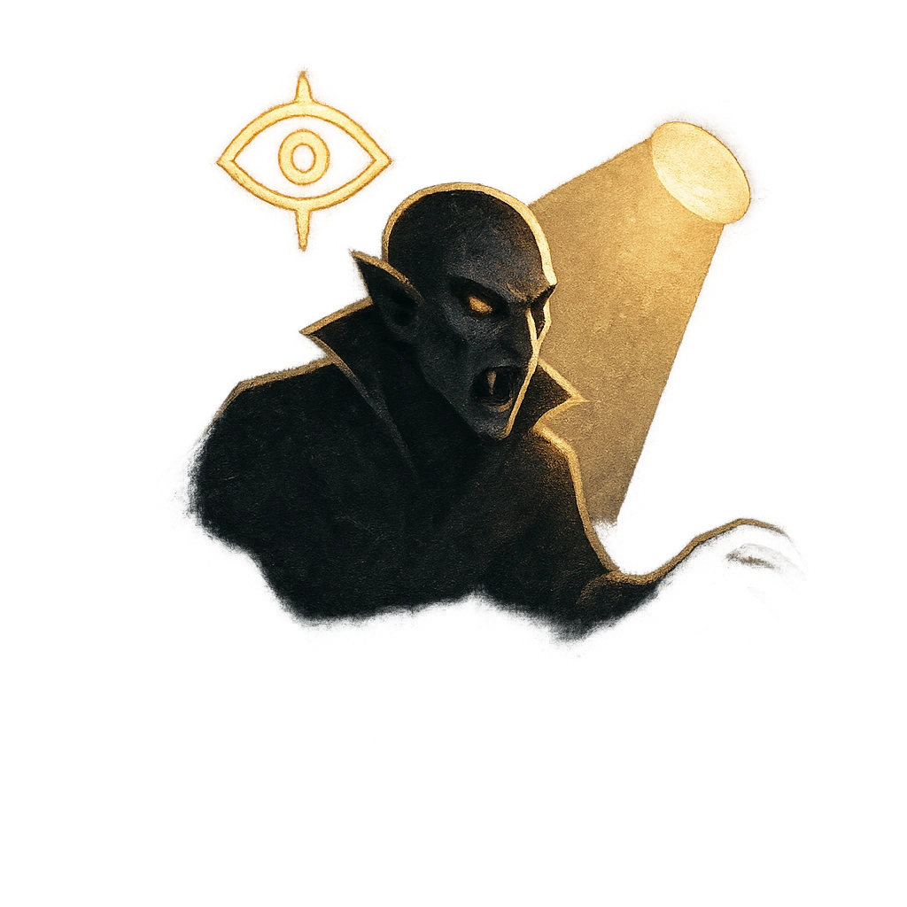

# The Hunt Is On

## Description
*
<strong>Spend 2 Fear</strong> to summon [[/r 1d4]] @UUID[Compendium.daggerheart.adversaries.Actor.WWyUp6Mxl1S3KYUG]{Vampires}, who appear at Far range and immediately take the spotlight.
*

## Actions
- 
**Summon Vampires** *Spend 2 Fear to summon [[/r 1d4]] @UUID[Compendium.daggerheart.adversaries.Actor.WWyUp6Mxl1S3KYUG]{Vampires}, who appear at Far range and immediately take the spotlight.*

---

adversaries-features/Leader
 
**UUID:** `Compendium.cybermancy.system.the-hunt-is-on`

