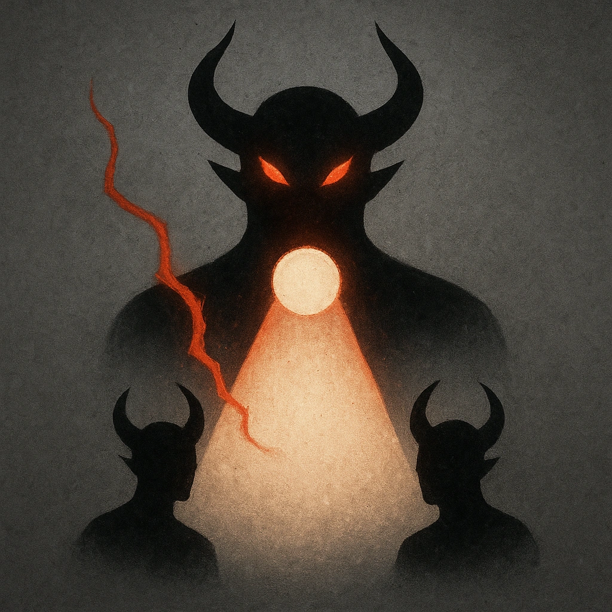

# The Root of Villainy

## Description
*
<strong>Spend a Fear</strong> to spotlight two other Demons within Far range.
*

## Actions
- 
**Spotlight Demons** *Spend a Fear to spotlight two other Demons within Far range.*

---

adversaries-features/Leader
 
**UUID:** `Compendium.cybermancy.system.the-root-of-villainy`

