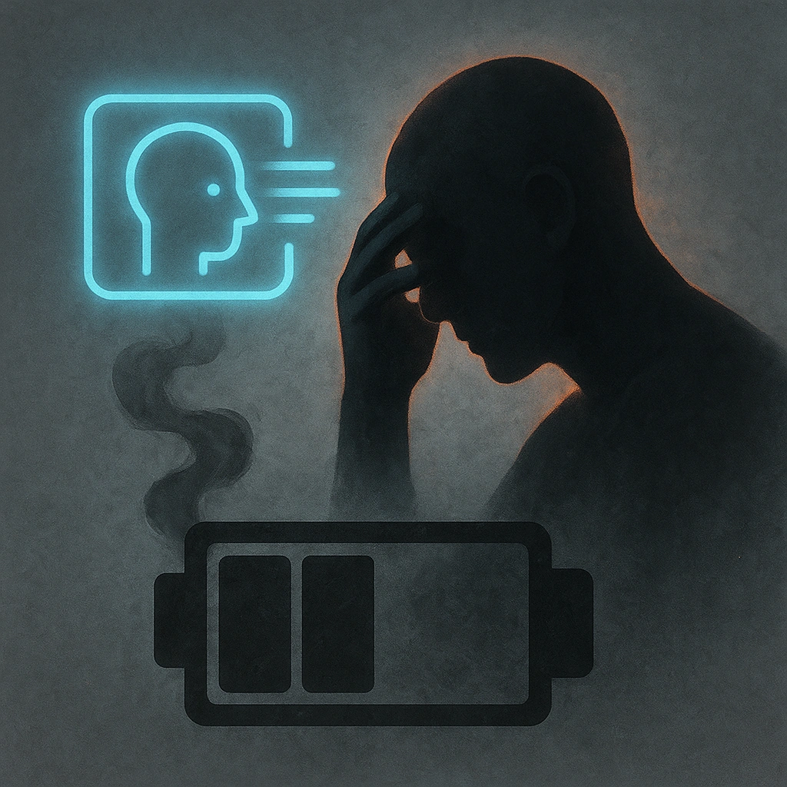

# The Runaround

## Description
*
When a PC rolls a 14 or lower on a Presence Roll made against the Merchant, they must mark a Stress.
*

## Actions
- 
**Stress Damage** *When a PC rolls a 14 or lower on a Presence Roll made against the Merchant, they must mark a Stress.*

---

adversaries-features/Social
 
**UUID:** `Compendium.cybermancy.system.the-runaround`

