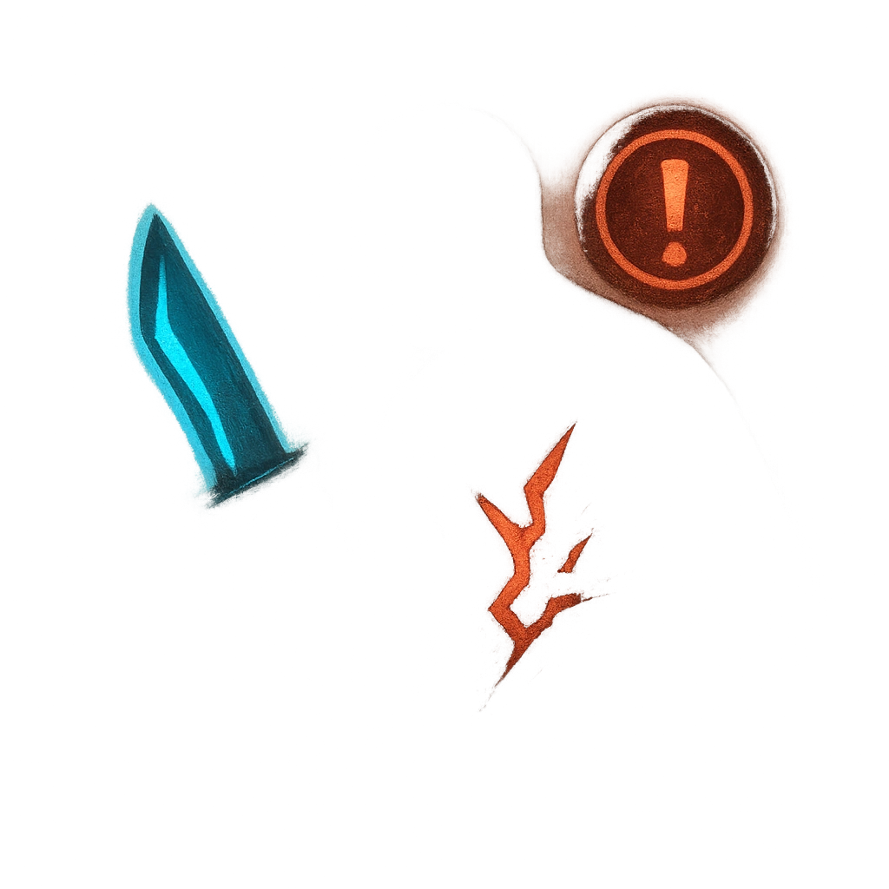

# The Subtle Blade

## Description
*
When the Assassin successfully makes a standard attack against a <em>Vulnerable</em> target, you can <strong>spend a Fear</strong> to deal Severe damage instead of their standard damage.
*

## Actions
- 
**Spend Fear** *When the Assassin successfully makes a standard attack against a Vulnerable target, you can spend a Fear to deal Severe damage instead of their standard damage.*

---

adversaries-features/Leader
 
**UUID:** `Compendium.cybermancy.system.the-subtle-blade`

