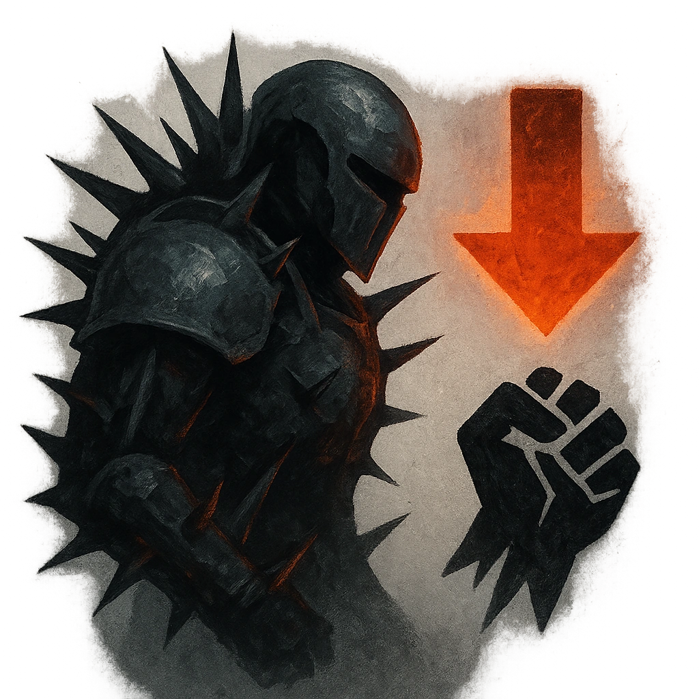

# Thorny Armor

## Description
*
When the Knight takes damage from an attack within Melee range, you can <strong>mark a Stress</strong> to deal <strong>1d10+5</strong> physical damage to the attacker.
*

## Actions
- 
**Damage** *When the Knight takes damage from an attack within Melee range, you can mark a Stress to deal 1d10+5 physical damage to the attacker.*

---

adversaries-features/Standard
 
**UUID:** `Compendium.cybermancy.system.thorny-armor`

