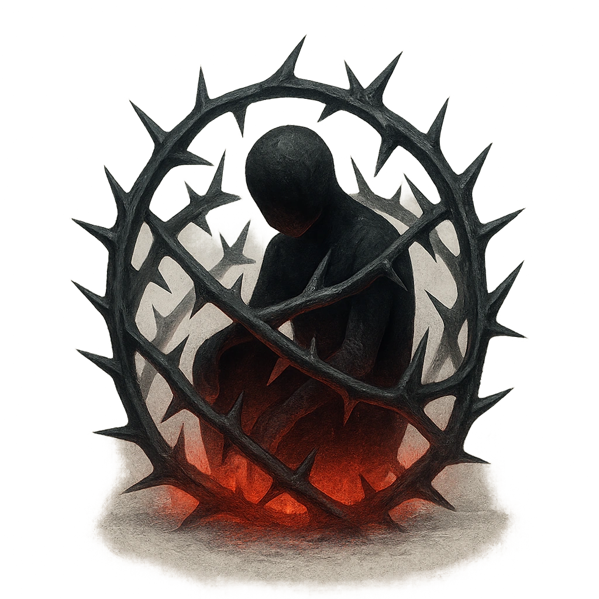

# Thorny Cage

## Description
*
<strong>Spend a Fear</strong> to form a cage around a target within Very Close range and Restrain them until they’re freed with a successful Strength Roll. When a creature makes an action roll against the cage, they must mark a Stress. 
*

## Actions
- 
**Spend Fear** *Spend a Fear to form a cage around a target within Very Close range and Restrain them until they’re freed with a successful Strength Roll. When a creature makes an action roll against the cage, they must mark a Stress.*

---

adversaries-features/Leader
 
**UUID:** `Compendium.cybermancy.system.thorny-cage`

