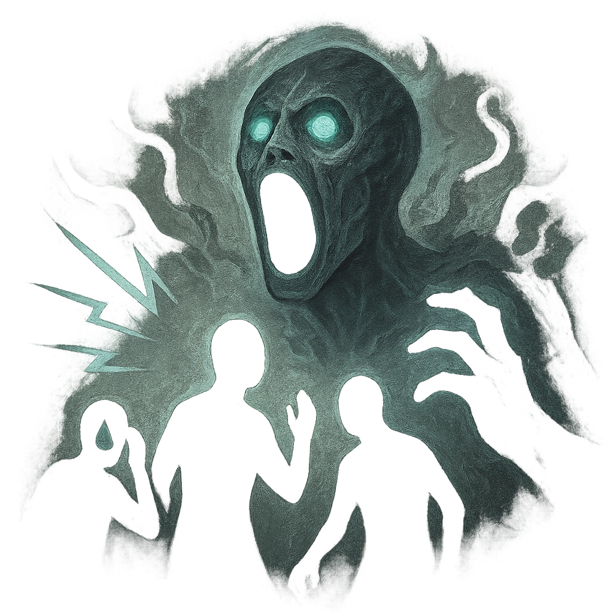

# Tormented Screams

## Description
*
<strong>Mark a Stress</strong> to cause all PCs within Far range to make a Presence Reaction Roll (13). Targets who fail lose a Hope and you gain a Fear for each. Targets who succeed must mark a Stress.

@Template[type:emanation|range:f]
*

## Actions
- 
**Mark Stress** *f]*

---

adversaries-features/Solo
 
**UUID:** `Compendium.cybermancy.system.tormented-screams`

