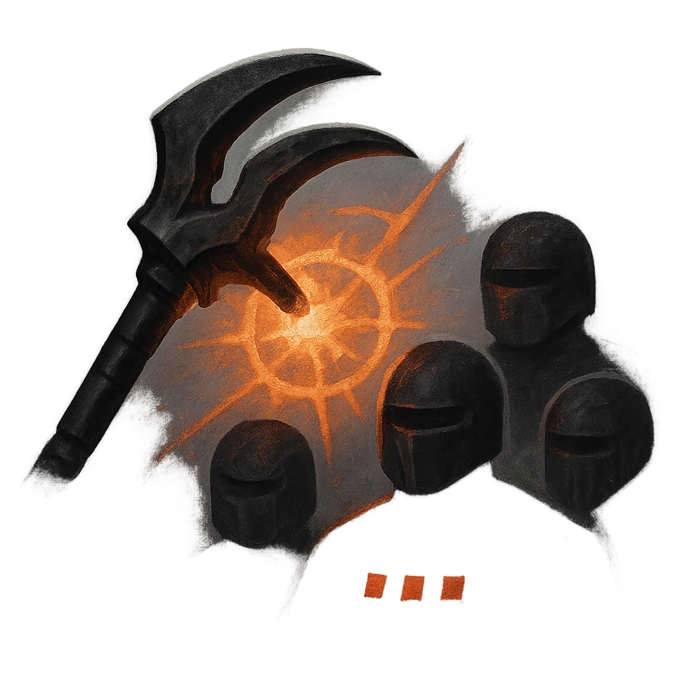

# Tormenting Lash

## Description
*
<strong>Mark a Stress</strong> to make a standard attack against all targets within Very Close range. When a target uses armor to reduce damage from this attack, they must mark 2 Armor Slots.

@Template[type:emanation|range:vc]
*

## Actions
- 
**Attack** *vc]*

---

adversaries-features/Solo
 
**UUID:** `Compendium.cybermancy.system.tormenting-lash`

