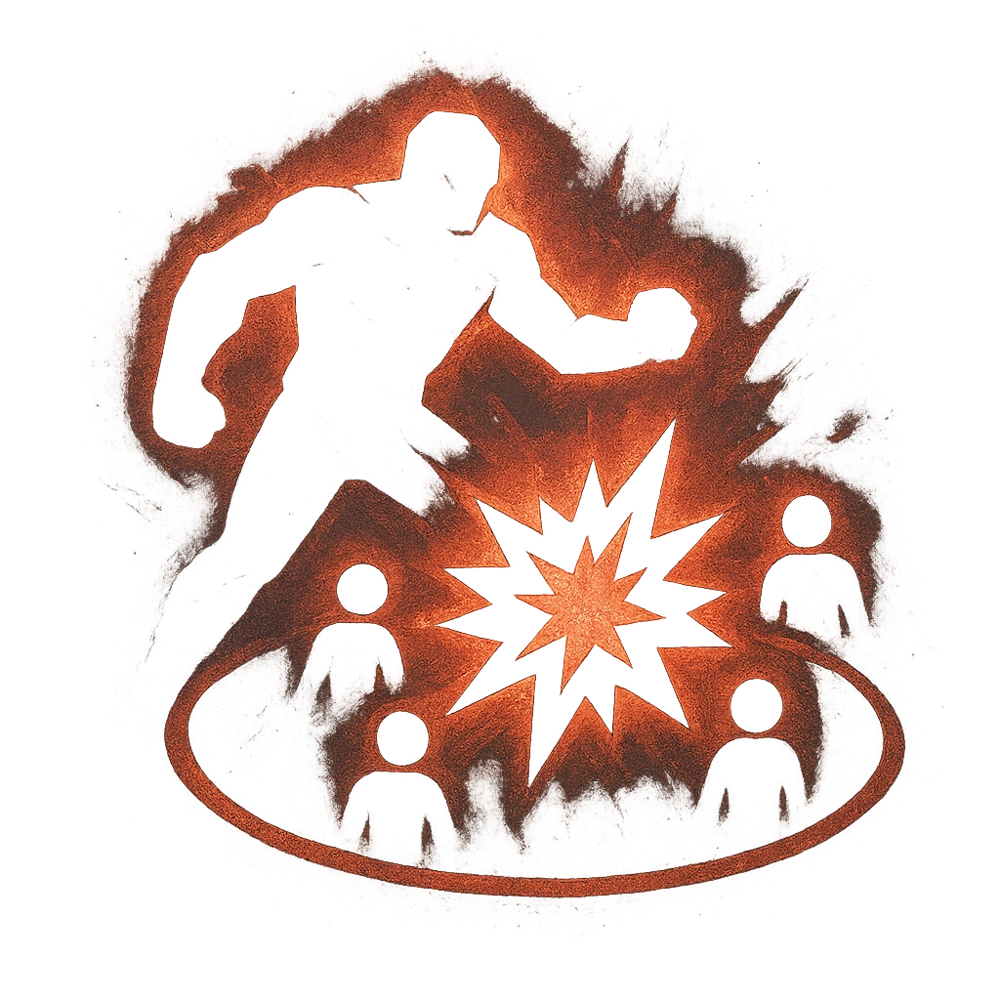

# Trample

## Description
*
<strong>Mark a Stress</strong> to make an attack against all targets in the Construct’s path when they move. Targets the Construct succeeds against take <strong>1d8</strong> physical damage.
*

## Actions
- 
**Attack** *Mark a Stress to make an attack against all targets in the Construct’s path when they move. Targets the Construct succeeds against take 1d8 physical damage.*

---

adversaries-features/Solo
 
**UUID:** `Compendium.cybermancy.system.trample`

