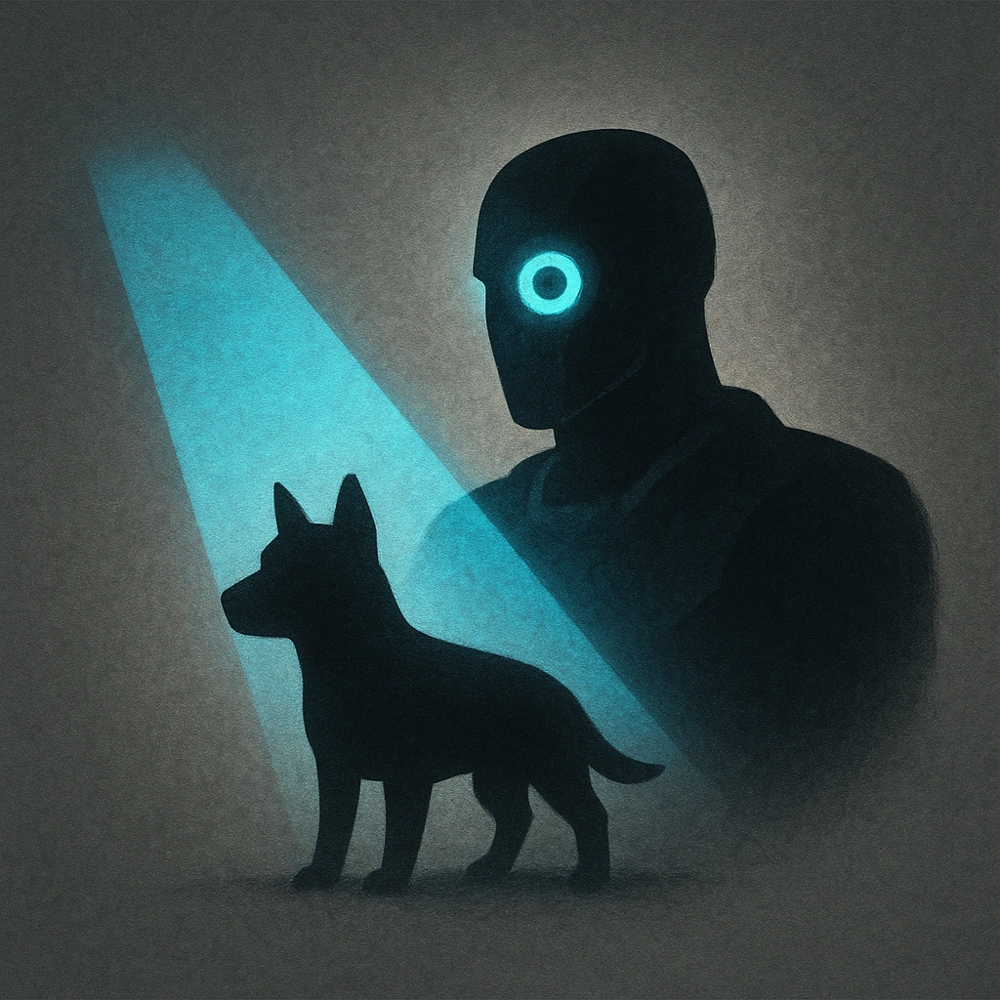

# Two as One

## Description
*
When the Beastmaster is spotlighted, you can also spotlight a Tier 1 animal adversary currently under their control.
*

## Actions
—

---

adversaries-features/Leader
 
**UUID:** `Compendium.cybermancy.system.two-as-one`

