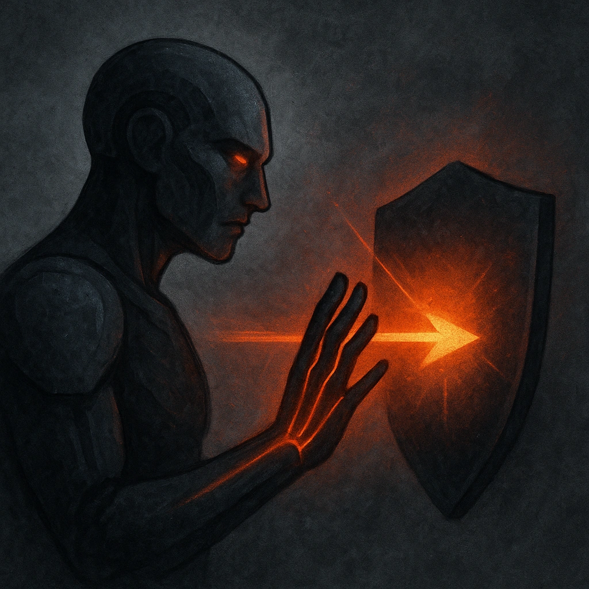

# Uncanny Reflexes

## Description
*
When the Flickerfly takes damage from an attack within Close range, you can mark a Stress to take half damage.
*

## Actions
- 
**Mark Stress** *When the Flickerfly takes damage from an attack within Close range, you can mark a Stress to take half damage.*

---

adversaries-features/Solo
 
**UUID:** `Compendium.cybermancy.system.uncanny-reflexes`

