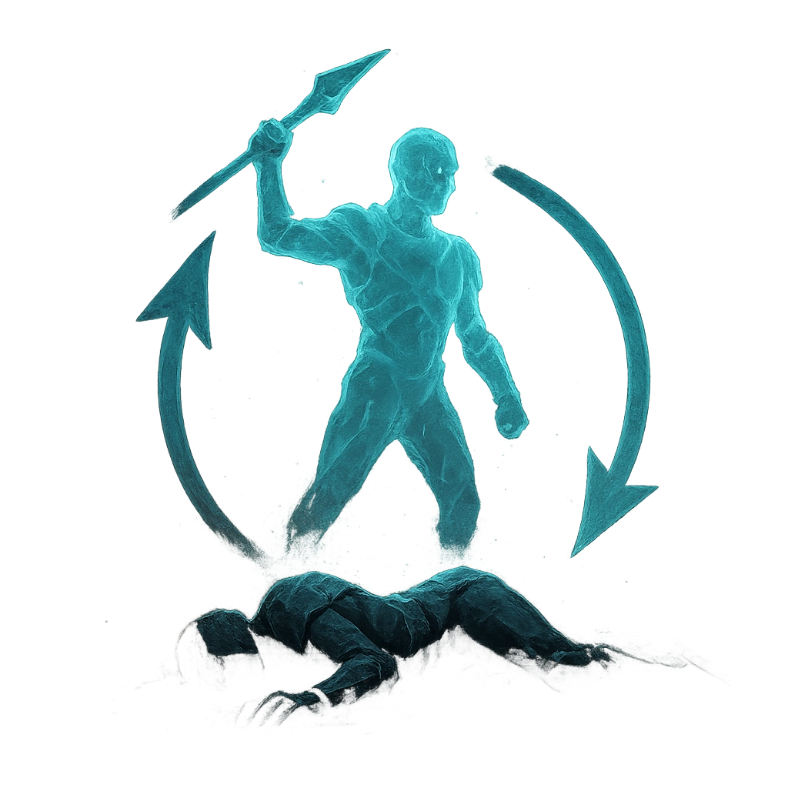

# Unending Battle

## Description
*
<strong>Spend 2 Fear</strong> to return up to [[/r 1d4+1]] defeated Spectral allies to the battle at the points where they first appeared (with no marked HP or Stress).
*

## Actions
- 
**Spend Fear** *Spend 2 Fear to return up to [[/r 1d4+1]] defeated Spectral allies to the battle at the points where they first appeared (with no marked HP or Stress).*

---

adversaries-features/Leader
 
**UUID:** `Compendium.cybermancy.system.unending-battle`

