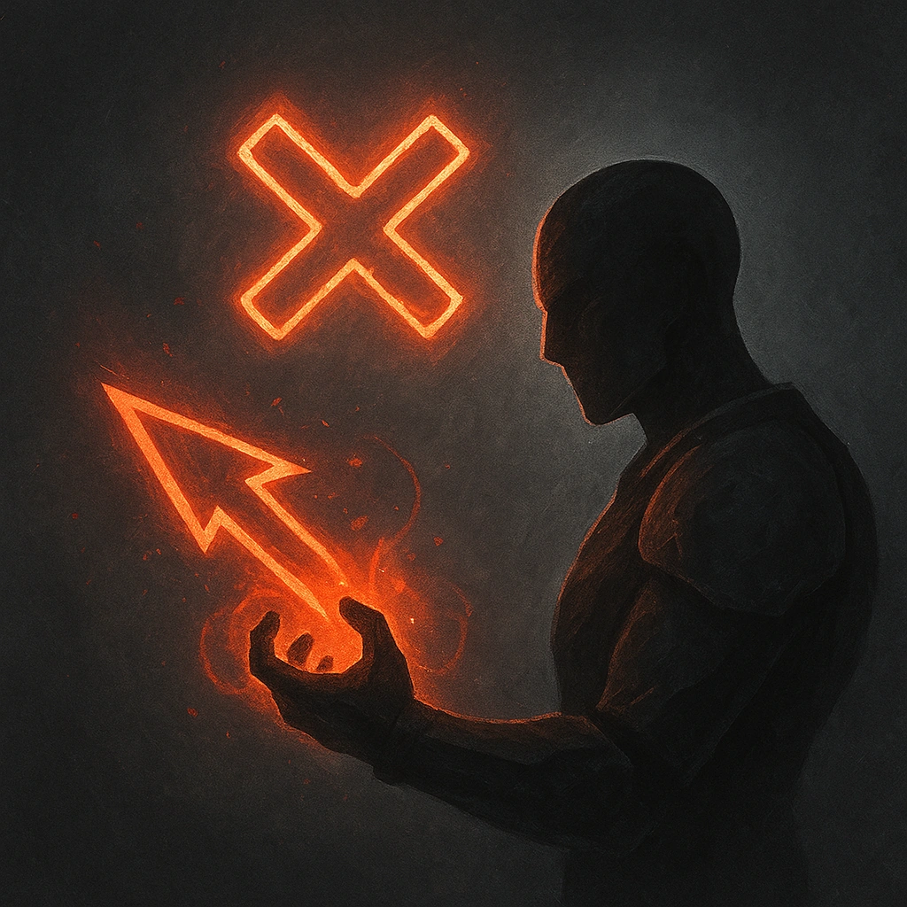

# Unparalleled Skill

## Description
*
<strong>Mark a Stress</strong> to deal the Demon’s standard attack damage to a target within Close range.
*

## Actions
- 
**Damage** *Mark a Stress to deal the Demon’s standard attack damage to a target within Close range.*

---

adversaries-features/Leader
 
**UUID:** `Compendium.cybermancy.system.unparalleled-skill`

