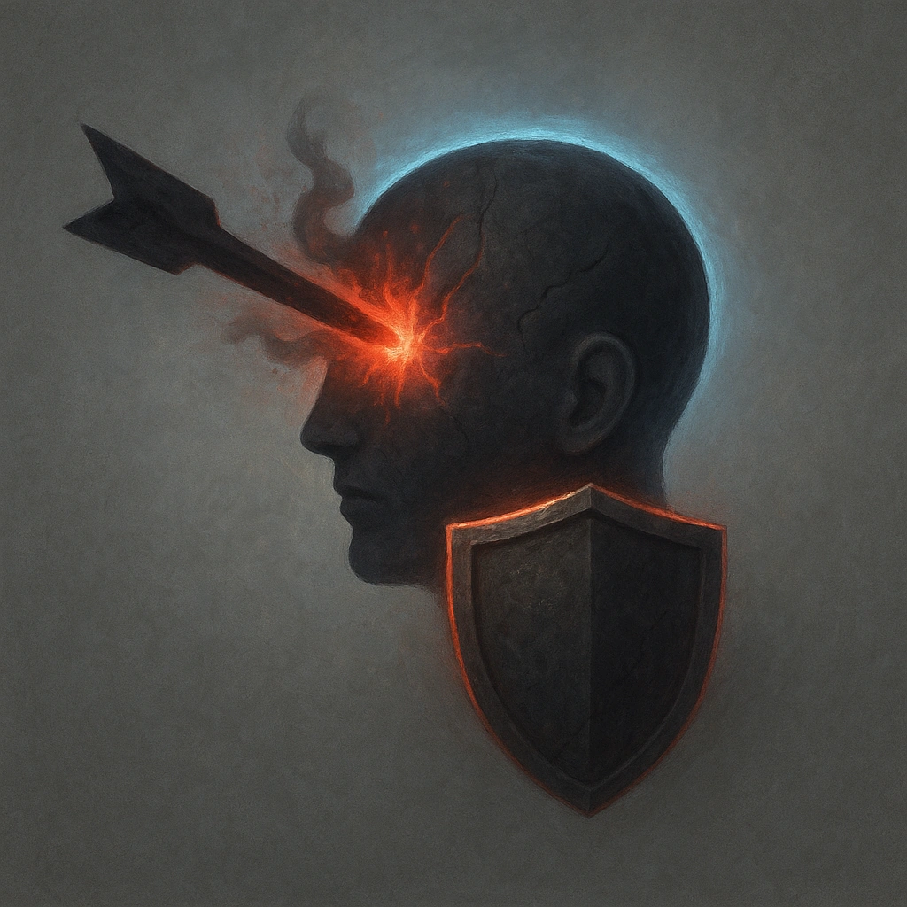

# Unprotected Mind

## Description
*
 The Demon’s standard attack deals direct damage.
*

## Actions
—

---

adversaries-features/Ranged
 
**UUID:** `Compendium.cybermancy.system.unprotected-mind`

