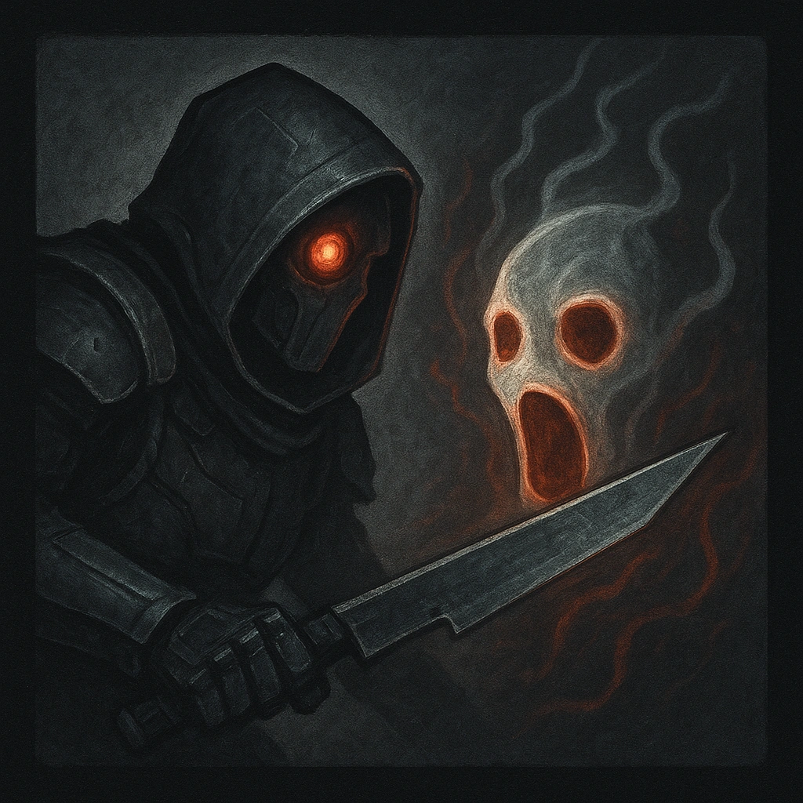

# Unreal Form

## Description
*
When the Abomination takes damage, reduce it by <strong>1d20</strong>. If the Abomination marks 1 or fewer Hit Points from a successful attack against them, you gain a Fear.
*

## Actions
- 
**Roll d20** *When the Abomination takes damage, reduce it by 1d20. If the Abomination marks 1 or fewer Hit Points from a successful attack against them, you gain a Fear.*

---

adversaries-features/Bruiser
 
**UUID:** `Compendium.cybermancy.system.unreal-form`

